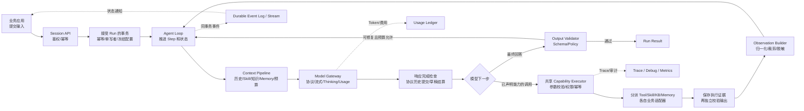
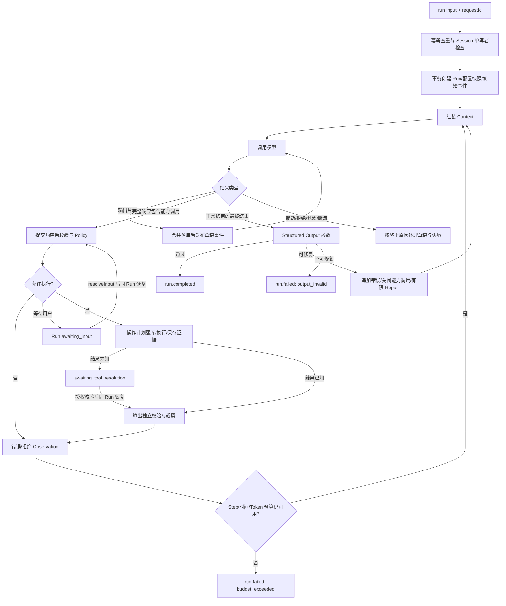
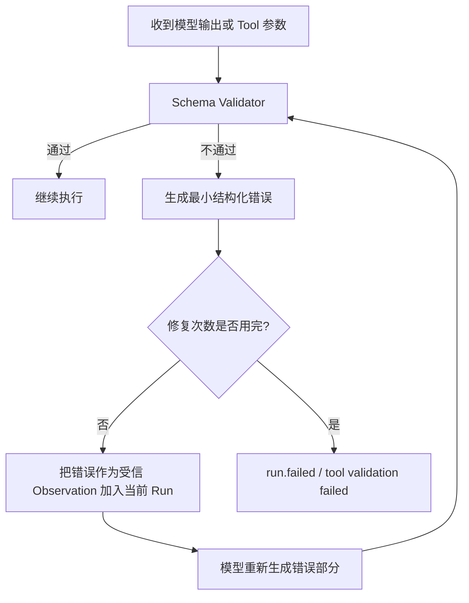
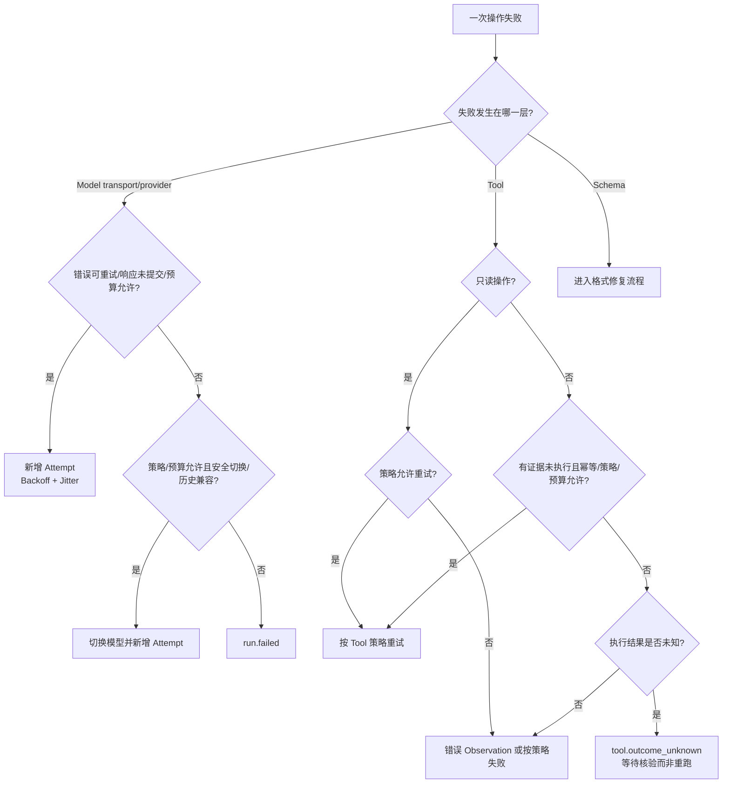
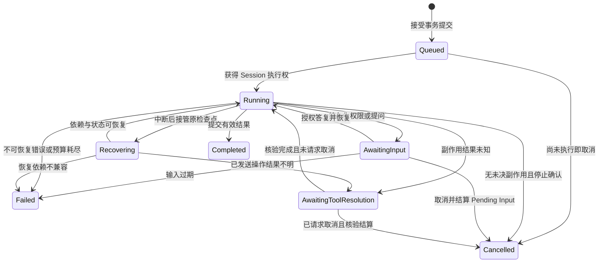

# Agent Engine 技术方案

> 2026-09-12 追加实现：图片与场景接入的公开 API 扩展见 [ADR 0006](adr/0006-scenario-usage-and-images.md)。本文 M0–M3 的可靠性、授权和预算约定继续适用。

> 状态：历史设计基线 · 已完成第二轮契约一致性修订；M0–M3 实现与后续审查修复见 [实施清单](implementation-plan.md)\
> 目标项目：`~/git/agent-engine`\
> 对照基线：WorkBuddy AI 5.4.2 / CodeBuddy CLI 2.132.0 恢复源码\
> 定位：通用、纯粹、与本地代码工作区无关的 Agent Engine\
> 实现口径：独立新建 Agent Engine，以 WorkBuddy 的已确认行为和边界案例为参考，重新设计公开契约，不复制私有源码、私有服务或内部协议

命名约定：应用级共享入口统一叫 **Agent Engine（Agent 引擎）**，使用 `createAgentEngine()` 创建。一个 Engine 管理多个 Session，每个 Session 可以执行多个 Run。目标项目路径统一为 `~/git/agent-engine`；本仓库的方案文件名和示例包名 `@agent-runtime/*` 暂保留，修改目录名不代表包已发布或依赖已迁移。

建设路线：新建核心、复用成熟基础组件、按行为对照 WorkBuddy。源码里看得到的机制不等于已经实测通过；不以“完美复现全部能力”作为首版承诺。借鉴范围、证据分级、测试方法和验收门槛见第 6.11～6.16 节。

首版边界：交付单进程 Engine、事务型持久化、完整能力配置入口、可靠 Loop、事件/Usage 与只读 Debug。Tool、Skill、知识库和 Memory 共享执行管线；不自建监控规则平台，不支持任意跨数据库事务，不交付 Full Replay 或多 Worker 调度。后续能力不得成为首版验收前置条件；本次审查闭环见第 6.16 节。

## 这个 Agent 框架要解决什么问题

这个项目不是再包一层模型 API，也不是只实现一个 `while (toolCall)` 循环。它要成为业务系统调用 Agent 的统一执行底座，让同一套机制覆盖普通问答、工具型 Agent、知识库问答、长期任务、监控分析和后台运行。

### 1. 稳定、可靠、完整的 Agent Loop

Engine 统一处理模型流式输出、Thinking、Tool Call、Skill、知识库、Memory、格式约束、重试、超时、取消、持久化、恢复和事件通知。

核心理念是“模型负责语义，工程负责确定性”：

- 模型负责理解目标、选择能力、规划步骤、判断下一步，以及根据 Tool、知识库和 Memory 的结果继续推理；
- 工程不硬编码开放式业务判断，只提供清晰的 Prompt、Schema、Observation 和状态边界；
- 工程必须负责格式校验、权限决策、超时、并发、幂等、Token Budget、状态机、持久化和可观测性；
- 模型输出或 Tool 参数不符合 Schema 时，把精简的结构化错误返回给模型，在同一个 Run 内修正；
- 已成功完成的有副作用操作不会因为格式修复或模型重试而再次执行；
- 权限、金额、数据库约束、合规和外部副作用必须由确定性代码或 Policy 控制。

### 2. 高度配置化，Session 显式拥有能力

新架构不预装、不默认启用任何业务 Tool、Skill、知识库或长期 Memory。创建 Session 时，调用方通过 `config` 显式传入本会话可以使用的全部能力：

- 模型来源：Provider、Base URL、Model ID、凭证引用、协议和能力声明；
- 模型策略：主模型、Fallback、Thinking、最大输出、超时、重试和上下文窗口；
- Tool：名称、描述、输入输出 Schema、执行器、权限和幂等策略；
- Skill：名称、描述、指令内容或加载方式、允许使用的 Tool；
- 知识库：检索器、查询 Schema、过滤范围、Top K 和引用规则；
- Memory：存储适配器、命名空间、读取策略、写入策略和保留周期；
- Loop：最大 Step、时间预算、Token Budget、格式修复次数和终止条件；
- 交互：是否允许模型在当前 Run 中提问、回答 Schema 与等待期限。

事件订阅在 Session 句柄上使用，Trace、Usage 导出和告警接入通过 Engine 基础设施配置；首版不再提供能任意改写 Loop 的通用 `hooks` 配置，避免和权限、重试、事件重复建立执行入口。

Engine 级配置只提供基础设施和全局策略默认值，例如事务型 Engine Store、Secret Provider、Telemetry Exporter，以及“所有 Session 的模型失败最多重试 x 次”。Engine 默认配置不能偷偷给 Session 增加 Tool、Skill、知识库或 Memory。高度配置化表示业务能力可声明、可替换，不表示每项内部策略都需要业务填写；首次接入使用安全默认值，高级覆盖必须经过校验。

标准 SDK 提供常用模型协议的适配实现，由 Session Config 的 `models[alias].provider` 自动选择；调用方通常无需传 `adapters`。这些实现负责协议转换，具体使用的模型、凭据和业务能力仍由 Session Config 声明。`adapters` 保留为特殊协议、替换实现和测试模型的可选扩展入口。

### 3. 纯 Agent Engine，不绑定本地开发环境

新架构没有工作目录、仓库、终端或本地隔离执行环境的领域概念。Engine 只认识 Session、Run、消息、模型和通过配置注入的能力。

如果业务需要读文件、执行 SQL、访问内部平台或操作第三方服务，应当把这些动作实现为 Tool/Connector，并由该 Tool 自己承担部署、认证和隔离责任。Engine 负责调用契约、权限、超时、幂等和记录，但不假设 Tool 在本机执行。

### 4. 可调试、可计量、可监控

框架提供统一事件协议和可选部署的只读 Debug Console，以 `Session → Run → Step → Attempt → Model/Tool` 为主链查看：

- 最终生效的 Session Config、配置版本和来源；
- 每次模型请求、流式回答、Thinking、Tool Call 和 Observation；
- Skill 选择、知识库检索、Memory 读取与写入；
- 格式校验、修复、Retry、Fallback、取消和失败原因；
- 输入、缓存、输出、Reasoning Token、费用估算和预算变化；
- 状态迁移、事件时间线、Trace 和经过脱敏的诊断信息。

Engine 自身暴露成功率、失败率、延迟、重试、格式修复、Tool 错误、Token、费用和事件积压指标。告警规则、窗口聚合与通知投递由应用已有的监控平台负责，首版不实现 `monitoring.rules` DSL 或通用通知 Outbox。业务监控任务则由外部 Scheduler 触发普通 Agent Run，数据查询和告警发送同样通过 Session Config 中声明的 Tool 完成。

## 先用白话说清楚几个概念

| 概念 | 白话解释 | 在新架构里的关系 |
| --- | --- | --- |
| Agent Engine / engine 对象 | 应用共享的一套 Agent 执行服务 | 管理多个 Session，统一提供 Loop、模型协议、重试、事件和存储；一般应用启动时创建一次 |
| Execution Context | 执行某个 Run 时临时使用的数据和控制对象 | 包含冻结配置、当前 Step、取消信号和预算；由 Engine 按需创建 |
| Session | 一段能持续多轮的任务档案 | 保存配置、历史、Memory 视图和多个 Run；不绑定任何目录 |
| Session Config | 这段会话的“能力清单和运行规则” | 创建 Session 时显式传入模型、Tool、Skill、知识库、Memory 等 |
| Run | Session 中一次用户输入触发的完整执行 | 完成、失败、取消是终态；等待输入或核验工具结果是可恢复的暂停态 |
| Agent Loop | Run 内反复“模型判断 → 调能力 → 接收结果 → 继续判断”的循环 | 一个 Run 有多个 Step |
| Step | 一轮模型决策及能力调用，或一次独立辅助模型任务 | 带 decision、input-repair、output-repair、compaction 等 purpose；辅助请求也计入预算 |
| Attempt | 同一个 Step 中一次真实的 Provider 请求 | 网络重试只新增当前 Step 的 Attempt；每次都单独计算 Token 和费用 |
| Tool | 模型可以调用的确定性动作 | 没有默认 Tool；只有 Session Config 里的 Tool 对模型可见 |
| Skill | 告诉模型某类任务应该怎么做的说明和资源 | 没有默认 Skill；配置后才会参与本 Session 的上下文 |
| 知识库 | 能搜索并返回带来源材料的数据源 | 通过配置的 Retriever/Connector 接入，不等同于长期 Memory |
| Memory | 跨轮或跨 Session 保留的用户/业务信息 | 存储和作用域都由 Session Config 声明，不依赖文件目录 |
| Thinking | 模型的推理输出或推理预算 | 和普通回答属于同一 Run，但用不同事件类型传输 |
| Structured Output | 要求最终结果符合指定 Schema | 校验失败后把错误反馈给模型修复，不从头重跑整个 Run |
| Retry | 某次可安全重放的操作失败后再次尝试 | Thinking 策略保持不变；有副作用 Tool 不能盲目重试 |
| Effective Config | 某个 Run 真正使用的完整配置快照 | 接受 Run 时合并并冻结；恢复不重新合并默认值，实时安全撤销仍可阻止后续操作 |
| Event | Engine 对外报告过程和结果的统一消息 | 所有事件有统一 Envelope，可持久化、回放和订阅 |
| Token / Cost | 每次真实模型请求消耗的用量和估算费用 | Retry、Fallback、格式修复、路由和子任务都纳入统计 |

文档导航：1 使用场景 → 2 分层架构 → 3 调用链与流程图 → 4 目录结构 → 5 模块使用与实现契约 → 6 WorkBuddy 对比、借鉴及审查闭环。

## 1. README：如何使用

以下接口是新项目的目标 API，用来固定技术方案和验收口径；当前仓库尚未实现这些包。

首版公开 SDK 为 TypeScript，输入先支持文本和可序列化 JSON，不承诺图像、音频、文件上传或嵌套多 Agent 编排；不支持的输入类型受理前报错。各场景是独立片段，不是在同一进程重复创建多个占用同一 Store 的 Engine。`modelConfig/baseConfig` 指下方由业务维护的基础模型配置，其他能力变量由业务定义；没有隐藏的默认能力。

### 1.1 最精简用法：创建 Engine

Engine 在应用启动时创建一次，供后续多个 Session 共享。这里配置存储、凭据解析和全局默认策略；标准 SDK 按 Session Config 的 `provider` 自动选择协议实现。

```ts
import { createAgentEngine } from "@agent-runtime/sdk";

const engine = await createAgentEngine({
  store: engineStore,
  secrets: secretProvider,
  telemetry: telemetryExporter,
  defaults: {
    retry: {
      model: { maxRetries: 3 },
    },
  },
});
```

这里的 `maxRetries: 3` 表示一次模型请求首次失败后最多再试 3 次，总 Attempt 最多为 4 次。它不会重跑整个 Run，也不会关闭 Thinking。

`engineStore` 是同一数据库内支持事务的 Engine Store，内部包含 Session、Run、消息、Event、Usage 和 Tool Ledger，不能分别注入不共享事务的数据库。下文以 `store` 简写该对象；标准发行包提供 PostgreSQL 实现，内存实现仅用于测试，不承诺重启恢复。

示例默认由可信后端应用在固定租户作用域内调用，Store、Secret Provider 和 Telemetry 已配置；不应把未鉴权的前端 Config 直接传入 Engine。服务化的可信身份绑定见第 5.18 节。`createSession()` 创建档案，`run()` 才执行任务。

### 1.2 场景：新建一个会话并使用

最小 Session 必须明确指定模型。下面创建一个仅用于问答的 Session；需要业务能力时，把相应定义填入同一个 `config` 的能力列表。

```ts
const modelConfig = {
  models: {
    primary: {
      provider: "openai-compatible", // 标准 SDK 自动选择对应协议实现
      baseURL: "https://model.example.com/v1",
      apiKey: { secretRef: "MODEL_API_KEY" },
      model: "chat-model-v1",
      limits: { contextWindowTokens: 128_000, maxOutputTokens: 8_192 },
    },
  },
  routing: { primary: "primary", fallbacks: [] },
};
const baseConfig = modelConfig;
const session = await engine.createSession({ config: baseConfig });

const result = await session.run({
  input: "解释一下为什么天空看起来是蓝色的",
});

console.log(result.outputText);
```

保存 `session.id`。一次 Session 可以执行很多次 `run()`，Engine 自动把已确认的对话历史纳入后续上下文。

没有填写的能力列表就是空，不会自动获得 Tool、Skill、知识库、Memory 或主动提问入口。`capabilities` 可以用于显式收窄模型特性；省略时由受测 Adapter 与模型元数据解析，并在真正使用 Tool、Thinking 或输出 Schema 前校验组合兼容性。

`createSession()` 校验配置、分配 Session ID、持久化 Config v1 和空历史，然后返回 Session 句柄。默认不调用模型、不执行 Tool；模型和远程能力连接按需建立，连通性探测应显式执行。创建另一个 Session 时可使用另一套模型、Tool、Skill、知识库和 Memory，仍复用同一个 Engine。

例如，在已有模型配置的基础上创建客服会话：

```ts
const supportSession = await engine.createSession({
  config: {
    ...modelConfig,
    tools: [queryOrder],
    skills: [supportReplySkill],
    knowledgeBases: [productDocs],
    memory: { stores: [customerMemory] },
  },
});

await supportSession.run({
  input: "查询订单 A1024，并按客服规范回复",
  output: { schema: KnowledgeAnswerSchema, mode: "prompt-json" }, // 引用契约见 1.7
});
```

这里的能力变量代表调用方定义的配置对象，不是 Engine 默认提供的能力。Tool、Skill、知识库和 Memory 的定义方式见后面的场景。

### 1.3 场景：已有一个会话，继续使用

```ts
const session = await engine.loadSession(savedSessionId);

const result = await session.run({
  input: "把刚才的解释改成适合小学生阅读的版本",
});
```

`loadSession()` 加载持久化 Session 和句柄，不会自行重跑未完成操作。未完成 Run 由恢复协调器按检查点接管；业务可调用 `session.getRun(runId)` 查看进度。HTTP/MCP 引用也需要核对定义版本和执行状态；进程内绑定必须提供匹配的版本化 `bindingKey`。无法满足恢复依赖时明确失败或等待核验，不能声称只凭 Endpoint 就可无条件恢复。

### 1.4 场景：给 Session 配置 Tool

Tool 不需要也不允许先“全局注册后默认可用”。定义出现在 `createSession().config.tools` 中，就是本 Session 的能力注册与权限申请；宿主授权通过后才实际可用。

```ts
import { defineTool } from "@agent-runtime/sdk";
import { z } from "zod";

const queryOrder = defineTool({
  name: "order.query",
  description: "根据订单号查询订单当前状态",
  inputSchema: z.object({
    orderId: z.string().min(1),
  }),
  outputSchema: z.object({
    status: z.enum(["created", "paid", "shipped", "closed"]),
    updatedAt: z.string(),
  }),
  execution: {
    type: "binding",
    bindingKey: "order.query.v1",
    timeoutMs: 5_000,
    sideEffect: "read",
  },
});

const engine = await createAgentEngine({
  store,
  secrets,
  bindings: {
    "order.query.v1": async ({ orderId }) => orderService.query(orderId),
  },
});

const session = await engine.createSession({
  config: {
    ...modelConfig,
    tools: [queryOrder],
    skills: [],
    knowledgeBases: [],
    memory: { stores: [] },
  },
});

await session.run({ input: "订单 A1024 发货了吗？" });
```

调用过程是：收齐并提交有效模型响应 → 校验 Tool 参数与权限 → 持久化操作计划 → 调用 Executor → 保存执行证据 → 独立校验结果 → 生成 Observation。首版不在 Tool 参数仍流式生成时提前执行。

如果参数格式错误，Engine 不调用 Tool，而是把错误路径返回模型：

```json
{
  "code": "TOOL_INPUT_INVALID",
  "tool": "order.query",
  "issues": [
    { "path": "orderId", "expected": "non-empty string" }
  ]
}
```

模型可在同一个 Run 内重新生成参数。这个过程是格式修复，不是重新启动整个 Agent。

### 1.5 场景：配置有副作用的 Tool

```ts
const sendRefund = defineTool({
  name: "refund.create",
  description: "为指定支付单发起退款",
  inputSchema: RefundInput,
  outputSchema: RefundResult,
  execution: {
    type: "http",
    endpoint: "https://payment.example.com/agent-tools/refund",
    auth: { secretRef: "PAYMENT_TOOL_TOKEN" },
    sideEffect: "write",
    idempotency: {
      required: true,
      namespace: "payments.refund", // 稳定的业务操作域，不跟随实现版本改变
      businessKey: { type: "binding", bindingKey: "refund.operation-key.v1" },
    },
    timeoutMs: 10_000,
  },
  reconciliation: { type: "binding", bindingKey: "refund.lookup-outcome.v1" },
  permission: "require-approval",
});
```

应用在 Engine 中绑定 `refund.operation-key.v1`，从经过校验的退款业务请求 ID 生成操作键；不能由模型随意生成，也不能只用 `toolCallId`。Engine 用“租户 + 稳定业务 namespace + 业务键”去重，并校验业务参数 Hash：同键同参数复用已有结果，同键不同参数报冲突。工具名称、Binding 或 Schema 版本只用于追溯，不进入业务去重键；升级工具不能让同一笔退款重新执行。业务有意再次退款时必须创建新的业务请求 ID，不能按参数相似度永久去重。

写 Tool 超时且无法确认远端结果时，进入 `outcome_unknown`，暂停 Run。通过配置的只读核验器查询，或由授权人员提交核验证据后继续；不能自动重试。退款已成功但返回格式错误时，保留“执行成功 + 输出无效”两个状态，不把格式错误当作退款失败。具体接口见第 5.6 节。

```ts
const refundSession = await engine.createSession({
  config: { ...baseConfig, tools: [sendRefund] },
});
await refundSession.run({
  requestId: verifiedRefundRequest.id,
  input: "按已审核的退款申请办理退款",
  context: { refundRequestId: verifiedRefundRequest.id }, // 可信宿主传入，不由模型生成
});
```

上例要求宿主已绑定业务键生成器、审批策略与核验器；实际退款金额和支付单仍由 Tool 对已审核申请核对，不能只因模型给出参数就放行。

### 1.6 场景：给 Session 配置 Skill

Skill 同样直接放进 Session Config，不存在默认安装或自动获得的 Skill。

```ts
import { defineSkill } from "@agent-runtime/sdk";

const incidentTriage = defineSkill({
  id: "incident-triage-v1",
  name: "故障初步研判",
  description: "分析监控指标和变更记录，给出影响范围、可能原因和下一步动作",
  instructions: `
1. 先确认指标时间窗口和异常起点。
2. 再查询同一时间窗口内的发布记录。
3. 结论必须区分事实、推断和未知项。
4. 证据不足时不得宣布根因已经确认。
  `.trim(),
  allowedTools: ["metrics.query", "deployments.list"],
});

const session = await engine.createSession({
  config: {
    ...modelConfig,
    tools: [metricsQuery, deploymentsList],
    skills: [incidentTriage],
    knowledgeBases: [],
    memory: { stores: [] },
  },
});

await session.run({ input: "判断支付服务这次错误率升高的可能原因" });
```

Engine 校验 `allowedTools` 是当前 `tools` 的子集。配置编译器仅在 Session 声明 Skill 时生成对应的选择/退出协议入口，模型通过明确调用选择 Skill，不靠解析回答中的自然语言猜测。首版同一 Run 最多激活一个 Skill；激活后收窄 Tool 集，退出或 Run 结束时释放，规则见第 5.7 节。

Skill 也可以通过配置的 Loader 获取：

```ts
const session = await engine.createSession({
  config: {
    ...baseConfig,
    tools: [contractLookupPolicy], // name: "contract.lookup-policy"
    skills: [{
      id: "contract-review-v3",
      name: "合同审查",
      description: "检查合同中的金额、期限和违约条款",
      source: {
        type: "loader",
        loaderKey: "skill-catalog",
        version: "3.2.1",
      },
      allowedTools: ["contract.lookup-policy"],
    }],
  },
});
```

Loader 只负责读取配置指定的 Skill；它不能把目录中的其他 Skill 自动暴露给 Session。

### 1.7 场景：接入知识库

知识库通过 `knowledgeBases` 声明，并明确配置检索实现、范围和引用要求。

```ts
import { defineKnowledgeBase } from "@agent-runtime/sdk";

const productDocs = defineKnowledgeBase({
  id: "product-docs",
  name: "产品文档库",
  description: "查询产品功能、限制和操作说明",
  retriever: {
    type: "binding",
    bindingKey: "kb.product.search.v2",
  },
  querySchema: KnowledgeQuerySchema,
  resultSchema: KnowledgeResultSchema,
  defaults: {
    topK: 8,
    filters: { status: "published" },
  },
  citation: {
    required: true,
    outputPointer: "/citations",
    fields: ["documentId", "title", "url", "chunkId"],
  },
});

const session = await engine.createSession({
  config: {
    ...baseConfig,
    knowledgeBases: [productDocs],
  },
});

const KnowledgeAnswerSchema = z.object({
  answer: z.string(),
  citations: z.array(z.object({ sourceId: z.string() })),
});

await session.run({
  input: "企业版的数据保留时间是多少？请给出来源。",
  output: { schema: KnowledgeAnswerSchema, mode: "prompt-json" },
});
```

模型决定何时检索以及如何改写查询；Engine 校验查询、限制 Top K、执行 Retriever，并为实际交给模型的片段附上 `sourceId`。模型在 `/citations` 返回这些 ID，Engine 校验后再映射到原始文档元数据，不靠从自然语言里猜引用。无可用证据时允许返回空引用并说明无法回答；有要求引用的可用检索结果时，缺引用或伪造 ID 进入有界输出修复。详细规则见第 5.8 节。

### 1.8 场景：接入长期 Memory

Memory 不写入某个工作目录。调用方配置 Store、命名空间和读写规则：

```ts
const session = await engine.createSession({
  config: {
    ...baseConfig,
    memory: {
      stores: [{
        id: "customer-memory",
        adapter: {
          type: "binding",
          bindingKey: "memory.customer.pgvector",
        },
        namespace: {
          tenantId: "tenant-42",
          subjectId: "customer-10086",
          agentId: "support-agent",
        },
        read: {
          strategy: "semantic",
          topK: 6,
          maxTokens: 2_000,
        },
        write: {
          strategy: "model-proposed-policy-approved",
          idempotency: {
            namespace: "customer-memory.write",
            businessKey: { type: "binding", bindingKey: "memory.proposal-key.v1" },
          },
          retentionDays: 180,
          redactPII: true,
        },
      }],
    },
  },
});
```

模型可以提出“值得记住的内容”，但 Engine 必须校验类型、命名空间、敏感信息和保留策略后才能写入。Session 对话历史和长期 Memory 是两份数据：历史记录“发生了什么”，Memory 保存“以后仍值得使用的事实或偏好”。

2026-09-13 文档宿主增加两个只读 Binding `sessions.search` / `sessions.read`，按可信访客查找和分页读取其他文档会话。原历史不自动写入 Memory，来源关系随 Operation 持久化；读取派生会话、再次模型派发及提交时重新检查来源权限与保留状态。事务内授权通过仅允许读取的宿主 Store 适配器使用当前快照，不重入串行存储事务。公共 SDK 不默认开放其他会话给模型；契约、来源失效传播与故障验证见 [历史会话工具](session-history-tools.md)。

### 1.9 场景：配置多个模型、Thinking 和 Fallback

```ts
const session = await engine.createSession({
  config: {
    models: {
      primary: {
        provider: "openai-compatible",
        baseURL: "https://model-a.example.com/v1",
        apiKey: { secretRef: "MODEL_A_KEY" },
        model: "reasoning-large",
        capabilities: {
          streaming: true,
          tools: true,
          thinking: true,
          structuredOutput: true,
        },
        thinking: {
          enabled: true,
          effort: "medium",
          expose: "summary",
        },
        limits: {
          contextWindowTokens: 128_000,
          maxOutputTokens: 8_192,
        },
        pricing: {
          currency: "USD",
          uncachedInputPerMillion: 2.5,
          cacheReadInputPerMillion: 0.5,
          outputPerMillion: 10,
        },
      },
      fallback: {
        provider: "anthropic-compatible",
        baseURL: "https://model-b.example.com",
        apiKey: { secretRef: "MODEL_B_KEY" },
        model: "backup-reasoning-model",
        limits: { contextWindowTokens: 64_000, maxOutputTokens: 8_192 },
        capabilities: {
          streaming: true,
          tools: true,
          thinking: true,
          structuredOutput: false,
        },
        thinking: {
          enabled: true,
          effort: "medium",
          expose: "summary",
        },
      },
    },
    routing: {
      primary: "primary",
      fallbacks: ["fallback"],
      fallbackOn: ["provider_unavailable", "rate_limited"],
    },
    ...capabilityConfig,
  },
});
```

上述价格仅演示配置，缓存写入或其他计价项未配置时对应费用保持未知。Reasoning 默认是归一化 Output 的子集，不额外重复计费；具体口径见第 5.15 节。

Fallback 先检查能力，再检查已提交历史是否能迁移。首版仅在当前 Step 尚无已提交响应、无待回传工具结果或原生 Thinking 续接块，且 Adapter 可以安全重建请求时切换；否则明确失败，不自动跨协议续接一半对话。备选模型不支持当前 Tool、Thinking 或原生 Structured Output 时，跳过或失败；换模型后重新计算上下文预算。

Retry 和 Fallback 都继承同一份 Thinking Policy。重试不会自动把 `thinking.enabled` 改成 `false`，也不会把 Thinking 事件伪装成普通回答事件。

### 1.10 场景：要求固定 JSON 格式

```ts
const result = await session.run({
  input: "判断这张工单的优先级",
  output: {
    schema: z.object({
      level: z.enum(["P0", "P1", "P2", "P3"]),
      reasons: z.array(z.string()).min(1),
      confidence: z.number().min(0).max(1),
    }),
    mode: "provider-native",
    maxRepairAttempts: 2,
  },
});

console.log(result.output);
```

校验失败时，Engine 追加一条不可伪造的系统 Observation：

```json
{
  "code": "OUTPUT_SCHEMA_INVALID",
  "issues": [
    { "path": "confidence", "expected": "number <= 1" }
  ],
  "repairAttempt": 1,
  "maxRepairAttempts": 2
}
```

模型只修最终输出。Repair Step 不暴露任何业务能力及其协议入口，之前的 Tool Observation 只作为上下文复用；不能只依赖 Prompt 告诉模型不要再次调用工具。修复请求仍计入 Step、Attempt、Token 和费用。`output.maxRepairAttempts` 只允许收窄已生效的修复上限。

### 1.11 场景：配置统一重试次数

给整个 Engine 的所有 Session 设置模型重试次数：

```ts
const x = 3;

const engine = await createAgentEngine({
  store,
  secrets,
  defaults: {
    retry: {
      model: {
        maxRetries: x,
        backoff: {
          type: "exponential-jitter",
          initialDelayMs: 300,
          maxDelayMs: 8_000,
        },
        retryOn: ["timeout", "rate_limited", "provider_5xx", "connection_reset"],
      },
      outputRepair: { maxAttempts: 2 },
      toolInputRepair: { maxAttempts: 2 },
      readonlyTool: { maxRetries: 1 },
      writeTool: { maxRetries: 0 },
    },
  },
});
```

某个 Session 可以覆盖普通值：

```ts
await engine.createSession({
  config: {
    ...baseConfig,
    retry: {
      model: { maxRetries: 1 },
    },
  },
});
```

合并顺序是：

```text
Engine Defaults → Session Config → Run Override → Policy Ceiling
```

Tool、Skill、知识库和 Memory 不参与继承合并；这些能力以 Session Config 的显式列表为准。单次 Run 只能收窄能力，不能临时加入 Session 从未声明过的能力。

如果“最多 x 次”是全项目硬限制，而不是允许 Session 覆盖的默认值，同时配置 `policy.ceilings.retry.model.maxRetries: x`。显式值超出上限时返回 `CONFIG_POLICY_VIOLATION`，不静默截小后假装原配置已生效；`getEffectiveConfig()` 可查看合并后的值与来源。

### 1.12 场景：实时展示回答、Thinking 和 Tool 状态

```ts
const off = session.onEvent(event => {
  switch (event.type) {
    case "content.output.delta":
      appendAnswerDraft(event.messageId, event.blockId, event.data.text);
      break;

    case "content.thinking.delta":
      appendThinkingDraft(event.messageId, event.blockId, event.data.text);
      break;

    case "content.message.committed":
      commitMessageDraft(event.messageId);
      break;

    case "content.message.discarded":
      discardMessageDraft(event.messageId);
      break;

    case "tool.started":
      renderToolRunning(event.data.name);
      break;

    case "tool.completed":
      renderToolCompleted(event.data.name);
      break;

    case "usage.recorded":
      renderUsage(event.data);
      break;

    case "run.failed":
      showFailure(event.data.error);
      break;
  }
});

const result = await session.run({ input: "分析这批数据" });

// 页面卸载或消费者不再需要事件时才调用 off()。
// 不在 run() 返回后立即退订，Usage 仍可能迟到。
```

所有事件使用统一 Envelope。`onEvent()` 是进程内实时订阅；需要可靠补拉和续订时使用第 5.14 节的 `subscribe({ afterSequence, onEvent })`。回答片段是草稿，按 `messageId + blockId` 渲染，并处理 `content.message.committed/discarded`，不能只把不同 Attempt 的文本直接拼接。

### 1.13 场景：统计 Token 和费用

```ts
const usage = await engine.usage.getRun(result.runId);

console.log({
  knownTokens: usage.knownTotals,
  complete: usage.complete,
  costByCurrency: usage.costByCurrency,
  costComplete: usage.costComplete,
  revision: usage.revision,
  attemptCount: usage.attemptCount,
});
```

每次真实模型请求都生成独立 Usage Record。Retry、Fallback、格式修复和用于 Skill/知识检索路由的模型请求都不能隐藏。

Provider 缺字段时保持未知，`knownTotals` 只汇总已有记录，必须同时展示完整性，不能将部分和冒充总消耗。缓存读取/写入与 Reasoning 的包含关系由 Adapter 归一化；迟到记录按 Attempt 更新并增加 revision。不同币种分别汇总，价格快照在接受 Run 时冻结，估算不冒充 Provider 账单。

### 1.14 场景：接入 Engine 自身监控

```ts
const engine = await createAgentEngine({
  store,
  secrets,
  telemetry: {
    traces: otelTraceExporter,
    metrics: prometheusExporter,
    logs: structuredLogExporter,
  },
});
```

在外部监控平台配置失败率、Tool 超时、事件发布延迟和 Store 不可用规则，通知由平台发送。这里监控 Engine 自己是否健康，不需要 Automation，也不需要模型判断服务是否宕机。告警出口不能只依赖同一个已故障的事件数据库。

### 1.15 场景：建立一个业务监控告警 Agent

业务监控不是 Engine 内部的特殊 Loop。外部 Scheduler 周期性调用一个普通 Session，该 Session 显式配置查询数据和发送告警的 Tool。

```ts
const monitorSession = await engine.createSession({
  config: {
    ...modelConfig,
    tools: [metricsQuery, deploymentsList, alertSendTool],
    skills: [incidentTriage],
    knowledgeBases: [runbookKnowledgeBase],
    memory: {
      stores: [monitorStateMemory],
    },
    loop: {
      maxSteps: 12,
      maxModelAttempts: 24,
      timeoutMs: 60_000,
    },
  },
});

await scheduler.every("5m", async occurrence => {
  await monitorSession.run({
    requestId: occurrence.id, // 调度重投时复用同一个请求 ID
    input: [
      `查询支付 API 指标，时间窗口为 ${occurrence.window.start} 至 ${occurrence.window.end}。`,
      "错误率超过 2% 才发送告警。",
      "必须附带指标证据和时间窗口。",
      "数据源不可用时报告监控失败，不得当作正常。",
    ].join("\n"),
    output: { schema: KnowledgeAnswerSchema, mode: "prompt-json" },
    context: {
      ruleId: "payment-error-rate", targetId: "payment-api",
      window: occurrence.window, destinationId: "payment-oncall",
    },
    metadata: {
      occurrenceId: occurrence.id,
    },
  });
});
```

调度任务用保存的 `occurrence.id` 去重 Run；通知业务去重则使用“租户 + 稳定告警规则 + 数据源/告警对象 + 窗口 + 目的地”，不能仅使用调度 occurrence，否则两个重叠任务仍可能重复通知同一窗口。外部通知服务按业务需求聚合、抑制或升级，不能由 Engine 硬编码一套告警规则。结果不明时停止自动重发。首版同一 Session 只允许一个未终结 Run，调度器收到 `SESSION_BUSY` 或 `ENGINE_BUSY` 时自行决定跳过或延后，不重新生成 requestId 绕过去重。

`occurrence.window` 由应用按该次计划触发时间生成并保存；重投时保持相同窗口，不在每次重试时重新解释“最近 10 分钟”。通知 Tool 只从经过授权的 `run.context` 取得规则、窗口与目的地，不从模型或 metadata 接受未经校验的投递目标。

这里复用的 `incidentTriage` 只允许查询指标和发布记录；模型完成研判后应退出 Skill，再调用 Session 已声明的通知 Tool。若业务希望在 Skill 内直接通知，需要显式把通知 Tool 加进该 Skill 的 `allowedTools`，不能默认越过白名单。

### 1.16 场景：打开 Debug Console

```ts
import { startDebugServer } from "@agent-runtime/debug";

const debugServer = await startDebugServer({
  engine,
  host: "127.0.0.1",
  port: 4319,
  auth: { type: "token", secretRef: "AGENT_DEBUG_TOKEN" },
  redaction: {
    hideSecrets: true,
    thinking: "summary-only",
    toolResults: "policy-based",
  },
});

console.log(debugServer.url);
```

Debug Console 可以查看 Session Config 快照、Run Timeline、Model Attempt、Tool Ledger、Usage 和失败链路。生产环境默认不展示 Secret、认证 Header、完整私有 Thinking 或未经策略允许的 Tool Result。

### 1.17 场景：更新已有 Session 的能力配置

配置更新使用乐观锁，对之后新接受的 Run 生效；已接受的 Run 使用接受时冻结的 Effective Config，重启恢复也不重新合并。实时安全策略仍可撤销权限，但不能扩权或暗改恢复中的模型协议。

```ts
const current = await session.getConfig();

await session.replaceConfig({
  ifVersion: current.version,
  config: {
    ...current.value,
    tools: [...current.value.tools, ticketCreateTool],
  },
});
```

能力数组采用全量替换，不做按名字的隐式深度合并。这样可以审计“这个 Session 在版本 7 时到底能用哪些能力”。

### 1.18 场景：取消、归档和删除

```ts
const run = await session.startRun({
  requestId: "analysis-request-1001",
  input: "执行一个较长的分析任务",
});

await session.cancelRun(run.runId, { reason: "user_cancelled" });
await run.result.catch(handleRunError); // 等待终态；取消按 RUN_CANCELLED 拒绝
await session.archive();
await engine.deleteSession(session.id);
```

- `cancelRun()` 持久化取消请求并触发协作式取消，返回不代表远端动作已经停止；通过 `getRun()` 或 `run.result` 查看最终状态；
- `archive()` 只改变 Session 可见性，不删除历史；
- `deleteSession()` 按数据保留策略删除或进入延迟清理流程；
- 已经发送到外部系统的副作用不会因为取消而自动回滚。
- 存在未结算 Run 或未知副作用时，归档/删除不得绕过核验与保留策略，具体边界见第 5.4 节。

## 2. 分层架构

### 2.1 如何使用分层架构

业务代码只依赖公开 SDK 和 Session Config，不直接调用 Model Provider、Tool Executor、Event Store 或内部 Loop：

```ts
const session = await engine.createSession({ config });
const result = await session.run({ input });
```

需要替换模型厂商、Tool 协议、知识库或 Memory 时，替换配置和 Adapter；业务调用方式保持不变。

### 2.2 逻辑分层

```text
┌─────────────────────────────────────────────────────────────────────┐
│  Application                                                        │
│  API / Web / Bot / Scheduler / Workflow                             │
└───────────────────────────────┬─────────────────────────────────────┘
                                │ createSession(config) / run(input)
┌───────────────────────────────▼─────────────────────────────────────┐
│  Public SDK                                                         │
│  Engine / Session / RunHandle / Event Subscription                 │
└───────────────────────────────┬─────────────────────────────────────┘
                                │
┌───────────────────────────────▼─────────────────────────────────────┐
│  Session & Configuration                                            │
│  Config Resolve / Version / Snapshot / History / Single Writer      │
└───────────────────────────────┬─────────────────────────────────────┘
                                │
┌───────────────────────────────▼─────────────────────────────────────┐
│  Run Orchestrator & Agent Loop                                      │
│  State Machine / Step / Attempt / Retry / Cancel / Budget           │
└───────────────┬───────────────────────┬─────────────────────────────┘
                │                       │
┌───────────────▼──────────────┐ ┌──────▼──────────────────────────────┐
│ Context Pipeline            │ │ Capability Executor                   │
│ History / Skill / KB /      │ │ Tool / Knowledge / Memory / Policy  │
│ Memory / Compact / Budget   │ │ Validation / Idempotency            │
└───────────────┬──────────────┘ └──────┬──────────────────────────────┘
                │                       │
┌───────────────▼───────────────────────▼─────────────────────────────┐
│ Model Gateway & External Adapters                                   │
│ Provider Protocol / HTTP / MCP / Binding / Secret Resolution        │
└───────────────────────────────┬─────────────────────────────────────┘
                                │
┌───────────────────────────────▼─────────────────────────────────────┐
│ Cross-cutting Infrastructure                                       │
│ Transactional Store / Event Log / Usage / Trace / Debug / Audit     │
└─────────────────────────────────────────────────────────────────────┘
```

### 2.3 各层职责

| 层 | 对外使用方式 | 核心职责 | 明确不负责 |
| --- | --- | --- | --- |
| Application | 调用 `createSession`、`loadSession`、`run` | 提供业务输入、能力配置和外部触发 | 自己实现 Agent Loop |
| Public SDK | `Engine`、`Session`、`RunHandle` | 稳定 API、类型、取消和事件订阅 | 厂商协议细节 |
| Session & Configuration | `config`、`replaceConfig` | 配置解析、版本、历史、单写者、快照 | 偷偷增加能力 |
| Run Orchestrator | `session.run()` | 单写者、Loop、状态机、Step/Attempt、恢复 | 业务语义判断或首版分布式调度 |
| Context Pipeline | Session Config 中配置策略 | 组装 History、Skill、知识、Memory | 无限制塞满上下文 |
| Capability Executor | Session Config 中传入能力 | 校验、权限、调用、Observation、幂等 | 提供默认业务 Tool |
| Model Gateway | Session Config 中传入模型 | 协议归一化、流式事件、Usage、错误分类 | 决定业务结果正确与否 |
| Infrastructure | Engine 创建时传 Store/Exporter | 事务存储、事件、Usage、Trace、审计 | 自建监控平台或跨库分布式事务 |

### 2.4 Session、Engine 和 Run 的关系

使用方式：应用启动时调用一次 `createAgentEngine()`，每段独立会话调用 `engine.createSession({ config })`，每次输入调用该 Session 的 `run()`。

命名统一为 Agent Engine：公开类型为 `AgentEngine`，创建函数为 `createAgentEngine()`，变量名用 `engine`。WorkBuddy 使用说明中的“Agent Runtime”有时指整套执行底座，有时指 Sidecar/Backend 执行资源；新方案的 Engine 固定指管理多个 Session 的共享引擎。单次运行仍称 Run，其临时状态称 Execution Context。

| 层次 | WorkBuddy 对应职责 | 新方案称呼 |
| --- | --- | --- |
| 共享执行服务 | Daemon 会话管理、Backend 编排、Runner 等共同提供 | Agent Engine / `engine` 对象 |
| 持久会话 | Session 记录、配置、历史 | Session |
| 一次输入的执行 | 一次 `prompt()` 驱动的循环 | Run |
| 临时执行资源 | Backend/Sidecar 及其运行状态 | Run Execution Context；无本地进程绑定要求 |

```text
一个 Engine
  ├── 管理 Session A
  │     ├── Config v1
  │     ├── Run A1
  │     ├── Config v2
  │     └── Run A2
  ├── 管理 Session B
  │     └── Run B1
  └── 使用共享基础设施：Store / Secret / Telemetry / Bindings
```

- Engine 是执行引擎和基础设施入口，通常应用启动时创建一次，可服务多个 Session；
- Session 是持久化业务对象，拥有历史和版本化能力配置；
- Run 是一次调用，接受时冻结 Config Version 和实际依赖清单；恢复游标与预算持久化，临时对象放入 Execution Context；
- Engine 进程消失不等于 Session 消失；新的 Engine 实例可以从 Store 恢复 Session；
- 两个 Session 即使引用同一个 `bindingKey`，可见的 Tool、权限和预算也分别由各自 Config 决定；
- 新架构不使用“Session 对应一个本地进程或本地目录”的假设。

### 2.5 配置分层

配置按职责分层，避免“高度配置化”演变为“所有东西都能从任意层覆盖”。

| 配置类型 | 放在哪里 | 示例 |
| --- | --- | --- |
| Engine Infrastructure | `createAgentEngine()` | Store、Secret Provider、Bindings、Telemetry |
| Engine Policy Defaults | `createAgentEngine().defaults` | Retry、超时、Budget 默认值 |
| Session Agent Config | `createSession().config` | Models、Tools、Skills、KB、Memory、Loop、权限 |
| Run Override | `session.run()` | 输出 Schema、较低预算、允许范围内的模型选择 |
| Policy Ceiling | Engine 管理策略 | 最大重试、最大费用、禁止的 Provider/Tool 类型 |

关键规则：

1. Session Agent Config 是业务能力的唯一声明清单，实际使用仍受宿主授权约束；
2. Tool、Skill、知识库、Memory 以及主动交互 `interaction` 不从 Engine Defaults 继承；
3. Run Override 只能收窄能力和资源，不能扩权；
4. Secret 只保存引用，不进入持久化 Config 明文、事件或日志；
5. 每个 Run 保存 Effective Config 的 Version、Hash、依赖版本和脱敏快照；恢复使用原快照而非当前默认值；
6. 首版提供安全默认超时、修复和上下文策略，不要求逐类填写 Token 配额；不支持的高级字段创建时明确拒绝；
7. Config 是声明范围，不是可信身份；实际授权来自宿主 Principal 与实时安全策略。冻结配置不能绕过权限撤销。

首版默认值也必须作为版本化契约公开，不能散落在各个 Provider 中：

| 配置项 | 首版默认值 | 说明 |
| --- | --- | --- |
| `retry.model.maxRetries` | 3 | 同 Step 的 Retry/Fallback 共享，最多 4 次真实请求 |
| `retry.outputRepair.maxAttempts` / `retry.toolInputRepair.maxAttempts` | 各 2 | 最终结果修复与工具输入修复分别计数 |
| `retry.readonlyTool.maxRetries` / `retry.writeTool.maxRetries` | 1 / 0 | 写操作不默认重试，未知结果必须核验 |
| `loop.maxSteps` / `loop.maxModelAttempts` | 16 / 64 | 含辅助模型调用；先达到哪个上限就阻止继续新调用 |
| `loop.maxCapabilityInvocations` | 64 | 实际能力调用次数，含重试、加载、检索、记忆读写和结果核验；防止一个模型响应派发大量操作 |
| `loop.timeoutMs` | 120,000 | 活动执行总时间；暂停等待使用单独的到期规则 |
| `models[alias].timeouts.attemptMs` / `streamIdleMs` | 60,000 / 30,000 | 单次请求总时限与无有效流片段时限；不能被心跳无限续命 |
| `permissions.timeoutMs` | 600,000 | 审批等待超时，不用于推断外部工具未执行 |
| `interaction` | 关闭 | 主动提问需在 Session 显式声明，不由 Engine 自动添加 |
| `context.compaction` | 触发 0.82、目标 0.60、每 Run 最多 2 个周期 | 每个周期内分块请求仍受全局 Step/Attempt 上限约束 |

这些是新方案拟定值，不是 WorkBuddy 默认值；在 M0 固化后变更应记录配置版本。模型窗口和最大输出不能靠通用常量猜测：标准 Adapter 有可信模型元数据时可推导，否则要求 Session 显式填 `models[alias].limits`。其余参数支持范围与默认值随 Config Schema 一起发布。

2026-09-15 按用户要求移除 Alice AI 诊断的固定累计运行上限，新增明确的可选语义：`loop.maxSteps/maxModelAttempts/maxCapabilityInvocations/timeoutMs` 可逐项设为 `null`，表示关闭该累计上限；省略仍继承上表默认值，不能用省略、0、极大数字或非 JSON 的 Infinity 伪装关闭。有限 Policy Ceiling 拒绝 `null`，Run Override 仅允许保持无限制或收窄；预算未配置且无默认/Policy 时不限制累计 Token/费用。授权、取消、用量记账、单请求/执行器有限超时、Retry/Repair、上下文容量及并发保护继续有效。序列化、恢复与来源记录保留 null，旧 Run 的冻结配置不变；这是有测试覆盖的显式扩展，未取消其他宿主的默认边界。

同日后续，Alice 的活动时间按用户要求保留 5 分钟，其模型 attempt/idle 与聚合工具时限均显式设置为 5 分钟，由 Engine 钳制到剩余活动时间，避免默认 60 秒/30 秒或工具 20 秒提前终止。Engine 区分单次模型时限与 Run 截止：由后者触发的模型中断结算为不可重试的 BUDGET_EXCEEDED，不进入 fallback；模型自身的请求/流超时仍为 MODEL_TIMEOUT。其他宿主默认值不变。

Engine 级并发配置使用 `limits: { maxAcceptedRuns: 128, maxConcurrentModelRequests: 16, maxConcurrentCapabilityRequests: 32 }`，表中数值为首版拟定默认值。`maxAcceptedRuns` 限制所有非终态 Run（包括暂停态）的数量，满额时新请求在受理前返回 `ENGINE_BUSY`；已有 requestId 的幂等查询不受此限制。模型和能力信号量在本进程内有界等待，不新建分布式队列；等待也计入活动超时，取消可移除尚未派发的请求。恢复和审批唤醒使用已有 Run 名额，不能因限额已满而无法恢复。业务 Binding 不支持强制终止，同样必须协作处理 AbortSignal；超时不证明它停止产生副作用。

## 3. 流程图

### 3.1 如何使用一次调用链

调用方只需要先订阅事件，再调用 `run()`：

```ts
const off = session.onEvent(renderEvent);
const result = await session.run({ input: "处理这张工单" });
// 消费者退出时调用 off()；执行结束后仍可收到用量修正。
```

一次调用中各模块的横向作用如下：



### 3.2 Agent Loop



### 3.3 数据格式错误处理



格式修复不是传输 Retry：

- 网络错误仅在当前响应可安全作废时重试已冻结输入，旧草稿显式标记 discarded；不拼接两次生成；
- 格式错误给模型新反馈并进入新的 Repair Step；该 Step 的模型请求产生自己的 Attempt；
- Tool 输入校验失败时 Tool 尚未执行；
- 最终输出校验失败时复用已经完成的 Tool Observation，并关闭所有业务能力入口；
- Tool 已执行后的输出格式错误保留独立执行状态，不允许通过“修格式”重做副作用；
- Thinking Policy 始终来自冻结的 Effective Config，不因修复或 Retry 改变。

### 3.4 Retry 与副作用判断



### 3.5 Session 与 Run 的状态边界

Session 创建后是可持久化档案；归档和删除属于档案生命周期，不与 Run 的执行状态混为一个字段。下图描述一次 Run；`queued` 仅表示已持久接受、尚待本进程调度，不表示首版支持多个 Run 排队。



## 4. 目录结构

### 4.1 如何使用这些包

普通业务使用 `@agent-runtime/sdk`。首版只拆 SDK、只读 Debug 和测试工具三个包；Core、协议、Provider、Executor、Store 在 SDK 内保持模块边界，暂不各自发布独立包。只有出现独立版本或部署需求时才拆包。

```text
agent-engine/
├── README.md
├── package.json
├── pnpm-workspace.yaml
├── tsconfig.base.json
├── packages/
│   ├── sdk/                            # @agent-runtime/sdk；公开入口与受测实现
│   │   └── src/
│   │       ├── public/                  # Engine / Session / RunHandle 公共 API
│   │       ├── protocol/                # JSON DTO、ModelBlock、事件与能力编译契约
│   │       ├── config/                  # Schema、Normalize、Merge、Version、Hash
│   │       ├── session/                 # 生命周期、历史、单写者、提交幂等
│   │       ├── run/                     # Run Orchestrator、状态机、恢复
│   │       ├── loop/                    # Step / Attempt / 决策循环
│   │       ├── context/                 # History、Skill、KB、Memory、Compact
│   │       ├── model/                   # Gateway、Capability Check、错误归一化
│   │       ├── tool/                    # Schema、Policy、Executor、Ledger
│   │       ├── capability/              # Config 编译及共享执行管线
│   │       ├── skill/                   # Definition、Resolver、Selection、Validation
│   │       ├── knowledge/               # Retriever、Citation、Result Validation
│   │       ├── memory/                  # Store、Namespace、Read/Write Policy
│   │       ├── output/                  # Structured Output、Repair
│   │       ├── retry/                   # Retry Classifier、Backoff、Replay Safety
│   │       ├── events/                  # Envelope、Sequence、Stream、Replay
│   │       ├── usage/                   # Usage Normalize、Pricing、Budget、Ledger
│   │       ├── policy/                  # 权限、上限、数据处理策略
│   │       ├── errors/                  # 稳定错误码和可重试分类
│   │       ├── storage/                 # 事务 SPI、PostgreSQL；内存实现只用于测试
│   │       ├── adapters/
│   │       │   ├── models/              # 常用模型协议；按受测能力清单发布
│   │       │   ├── executors/           # Binding / HTTP / MCP
│   │       │   └── telemetry/           # OTel/指标/日志出口
│   │       └── assembly/                # 标准发行包装配，不向 Session 注入业务能力
│   ├── debug/                          # @agent-runtime/debug；单包内含 server / ui
│   └── testing/
│       └── src/                         # Fake Model、Fake Tool、Clock、Fixtures
├── apps/
│   ├── example-api/
│   └── debug-example/                  # 启动 debug 包的示例，不重复实现 UI
├── examples/
│   ├── basic-session/
│   ├── tool-agent/
│   ├── skill-agent/
│   ├── knowledge-agent/
│   ├── memory-agent/
│   └── monitoring-agent/
├── tests/
│   ├── contract/
│   ├── integration/
│   ├── recovery/
│   └── compatibility/                   # 行为契约对照，不是 WorkBuddy 私有协议兼容
│       └── workbuddy-behaviors/         # 自建脱敏 Fixture、Scripted Model、边界断言
└── docs/
    ├── configuration.md
    ├── events.md
    ├── retry-and-idempotency.md
    ├── usage-and-billing.md
    ├── workbuddy-comparison.md
    └── workbuddy-behavior-baseline.md    # 行为 ID、证据、采用决策、目标测试、验收状态
```

### 4.2 模块与包依赖规则

```text
sdk/public → core modules + protocol
sdk/assembly → core SPI + concrete adapters
model/executor/storage adapters → protocol + SPI types
debug → sdk read-only query facade
debug/ui → debug/server API
testing → sdk contracts（仅开发依赖）
application → sdk；按需启动 debug
```

约束：

- Core 模块不反向依赖具体 Provider、数据库或业务 Tool，具体实现在装配入口组合；
- Provider 不知道 Session Store；
- Tool Executor 不知道 Agent Loop；
- Debug 只读查询，不通过界面触发真实模型、Tool 或修改运行数据库；
- 测试 Fake 不进入生产依赖；
- 没有任何包根据本地目录自动发现能力。

## 5. 实现细节

本章统一采用“先写使用方式，再写内部实现”的顺序。

### 5.1 Public API

#### 使用方式

```ts
const engine = await createAgentEngine(options);
const session = await engine.createSession({ config });
const existing = await engine.loadSession(session.id);

const off = existing.onEvent(handler);
const run = await existing.startRun({ requestId, input, output, metadata });

const result = await run.result;
// 断线重连或进程重启后可查询，不需要重新提交输入：
const snapshot = await existing.getRun(run.runId);
// 消费者退出时调用 off()；不是在最终文本到达时立即退订。
```

#### 内部实现

```ts
export interface AgentEngine {
  forPrincipal(principal: VerifiedPrincipal): AgentEngine;
  createSession(input: CreateSessionInput): Promise<AgentSession>;
  loadSession(sessionId: string): Promise<AgentSession>;
  deleteSession(sessionId: string): Promise<void>;
  listSessions(query?: SessionQuery): Promise<SessionSummary[]>;
  usage: UsageQueryService;
  close(): Promise<void>;
}

export interface AgentSession {
  readonly id: string;
  run(input: RunInput): Promise<RunResult>;
  startRun(input: RunInput): Promise<RunHandle>;
  getRun(runId: string): Promise<RunSnapshot>;
  getSnapshot(): Promise<SessionSnapshot>;
  onEvent(handler: (event: AgentEvent) => void): () => void;
  subscribe(input: SubscribeInput): Promise<EventSubscription>;
  listEvents(query?: EventQuery): Promise<EventPage>;
  getConfig(): Promise<VersionedSessionConfig>;
  getEffectiveConfig(input?: { runId?: string }): Promise<EffectiveConfigView>;
  replaceConfig(input: ReplaceConfigInput): Promise<VersionedSessionConfig>;
  cancelRun(runId: string, input?: CancelInput): Promise<void>;
  resolveInput(requestId: string, input: ResolveInput): Promise<void>;
  reconcileOperation(operationId: string): Promise<OperationOutcomeSnapshot>;
  resolveOperationOutcome(operationId: string, input: VerifiedOperationOutcome): Promise<void>;
  archive(): Promise<void>;
  unarchive(): Promise<void>;
}
```

`startRun()` 等待接受事务提交后才返回含 `runId`、`result` 和 `cancel()` 的句柄，不能把尚未落库的 Run ID 当作成功接受。`run()` 等价于接受 Run 后等待 `result`：完成时返回 `RunResult`，失败或取消时抛 `AgentEngineError`。等待审批/核验时 Promise 保持 pending，但工作器释放执行资源并持久化等待状态；HTTP 接入应使用 `startRun()` 返回运行 ID，不能依赖长连接一直存活。

`RunInput` 中 `requestId / ifConfigVersion / input / output / overrides / context / metadata` 是不同职责：`requestId` 用于重投去重，`ifConfigVersion` 可约束受理版本，`output` 固定最终结果约束，`overrides` 只接受已声明模型选择、能力子集和更低预算等白名单项。`context` 是可信宿主提供、只交给授权器与 Binding 的可序列化业务上下文，例如已经验证的退款申请 ID；它不自动进入 Prompt。`metadata` 仅用于观测关联，不得用于金额、收件人、幂等键或权限判断。非序列化的输出 Schema 同样先规范化；Effective Config 保存归一化后的 `output`，不是在每次重试时读取调用方内存对象。

`getEffectiveConfig()` 不传 Run ID 时返回下一次受理的脱敏预览及来源，包含 `sessionConfigVersion/defaultsVersion/policyVersion`；不是预留或冻结承诺。传 `runId` 时返回该 Run 已冻结的快照、有效能力清单和依赖版本；实时撤权另标注，不改写原快照。`RunResult` 至少包含 `runId`、`outputText`、`output`、`citations`：无输出 Schema 时 `output` 为文本；有 Schema 时为已验证的 JSON，`outputText` 为最终文本表示；`citations` 仅包含验证后的来源元数据。请求费用仍通过 Usage 查询。

`getRun()` 返回状态、取消请求、待处理输入/操作、已提交输出、错误及 `snapshotSequence`；`getSnapshot()` 返回用于恢复展示的会话投影和同事务读取的 `snapshotSequence`。它们不触发模型调用。`loadSession()` 只获取句柄；恢复协调器按原 Run 的检查点继续，不能由客户端重发 Prompt 来模拟恢复。

Run 提交规则：

- `requestId` 是调用方的重投幂等键；进程内便利调用可由 SDK 生成，但网络客户端和 Scheduler 必须保存并复用它。
- `(tenantId, sessionId, requestId)` 唯一；先验证调用者有权访问 Session/原 Run，再返回幂等结果。业务 Hash 覆盖规范化 `ifConfigVersion/input/output/overrides/context`，不含观测 metadata 或后来改变的默认值；同键不同业务 Hash 报 `RUN_REQUEST_CONFLICT`，不能用去重入口探查他人 Run。对原请求的精确重投先返回原 Run，不因当前 Session 版本已更新而触发版本冲突。
- 先查幂等记录，再检查 Session 是否已有非终态 Run；有则报 `SESSION_BUSY`，首版不自动新建会话或并发执行。暂停中的 Run 也占用这个名额。
- 接受事务同时占用 Session 活跃槽位、保存用户输入和 Effective Config、创建 Run 与初始事件；重复提交不因当前 Config 已更新而改变原 Run。
- `RunResult` 只表示完成的执行结果，不保证全部 Usage 已结算；费用查询必须查看完整性及 revision。
- `close()` 停止接受新 Run，做有界的流式/事务收尾并停止本进程；不能因进程退出把未确认的远端写操作标成失败或成功。

`startRun()` 的返回只确认已经受理；客户端断线不会取消它。句柄的 `result` 在后台失败而无人 await 时也不能产生未处理 Promise rejection。Engine 关闭导致当前进程无法继续等待时，以 `ENGINE_CLOSED` 拒绝本地等待句柄，但持久 Run 保留可恢复状态；这不是 `run.failed`，下次进程按 Run ID 查询。创建 Session 也支持 `CreateSessionInput.requestId`，在“租户 + 所有者 + 创建请求 ID”范围去重；重投不同配置报 `SESSION_REQUEST_CONFLICT`，防止创建回包丢失导致多建会话。

`forPrincipal()` 只由可信宿主调用，返回受该身份约束的视图，不创建第二个 Engine 或数据库写者。`close()` 等基础设施管理操作只允许启动 Engine 的宿主身份，不授予普通 Session 使用者。

### 5.2 Session Config 与生效规则

#### 使用方式

```ts
const config = defineSessionConfig({
  models,
  routing,
  tools,
  skills,
  knowledgeBases,
  memory,
  instructions,
  context,
  loop,
  retry,
  permissions,
  budgets,
  interaction,
});

await engine.createSession({ config });
```

#### 内部实现

建议核心类型：

下面是持久化后的规范化类型。`createSession().config` 接收输入类型，由 SDK 补齐 `schemaVersion: "1"`；能力列表缺省时规范化为空列表，不从 Engine 继承业务能力。

```ts
export interface SessionAgentConfig {
  schemaVersion: "1";
  models: Record<string, ModelConfig>;
  routing: ModelRoutingConfig;
  tools: ToolDefinition[];
  skills: SkillDefinition[];
  knowledgeBases: KnowledgeBaseDefinition[];
  memory: MemoryConfig;
  instructions?: InstructionConfig;
  context?: ContextConfig;
  loop?: LoopConfig;
  retry?: RetryConfig;
  permissions?: PermissionConfig;
  budgets?: BudgetConfig;
  interaction?: InteractionConfig;
  metadata?: Record<string, JsonValue>;
}
```

创建 Session 时依次执行：

1. 从宿主可信上下文确定 Principal 和 Tenant Scope；
2. 输入 Schema 校验、Schema 转换及 JSON 规范化；
3. 合并 Engine Defaults；保留显式配置与默认值来源，不继承业务能力；
4. 应用 Policy Ceiling，校验生效后的范围与参数组合；
5. 名称唯一性、跨引用和模型能力校验；
6. 校验 Secret/Binding/Loader/Endpoint 的可解析性和使用授权，不自动发起远程探测；
7. 编译显式能力契约并记录协议名称映射；
8. 生成 Config Version、Hash 和来源清单；
9. 在同一 Store 事务中持久化 Session、Config v1 与 `session.created`；
10. 发布已提交事件并返回句柄。

Session 持久化保留“调用方显式值 + 规范化定义”，Engine Defaults 在创建时用于校验和预览，不能被抹去来源后全部变成 Session 显式覆盖值。新 Run 按当时的 Defaults 与 Session 显式值生成有效快照；相同 `requestId` 的重投以及已接受 Run 的恢复则始终使用旧快照。`getConfig()` 返回版本化声明，Debug 的 Effective Config 另显示该 Run 的完整合并结果。

合并使用字段白名单：普通对象递归合并已知字段；能力数组以及 `retryOn/fallbacks` 等策略数组整体替换；省略表示继承，空数组表示清空，`null` 仅在 Schema 明确允许时有意义。Engine Defaults、Session、Run 显式值超出硬上限时拒绝，不静默更改。未显式填写的预算字段继承 Policy Ceiling，来源标记为 `policy-ceiling`；已填写的费用币种必须与硬上限一致。`replaceConfig()` 与受理 Run 在 Session 版本上串行化；Run 可通过 `ifConfigVersion` 要求指定版本，版本不符受理前报 `CONFIG_VERSION_CONFLICT`。Engine 的 Defaults/Policy 在实例存活期间不原地热更新，变更需新版本启动；实时撤权走独立授权器。

`defineTool()`、`defineKnowledgeBase()` 等开发辅助函数可以接收 Zod Schema，但 Config Normalizer 必须在持久化前把它转换成标准 JSON Schema。最终保存和参与 Hash 的 Session Config 必须完全 JSON 可序列化：不允许保存函数、类实例或 Secret 明文；可执行实现统一保存为 `adapter type + bindingKey/endpoint` 引用。

只接受可无损转换的 Schema 子集；无法序列化的 `refine/transform` 等自定义逻辑必须拒绝或显式绑定版本化 Validator，不能静默丢掉校验。首版公开支持范围并拒绝未实现配置字段，避免“配置已接受但实际不生效”。

普通调用无需提供模型 Adapter Registry：标准 SDK 已装配常用模型协议。只有特殊协议或测试模型需要在创建 Engine 时显式注入，其他扩展仍按对应 SPI 配置：

```ts
const engine = await createAgentEngine({
  store,
  secrets,
  adapters: {
    models: {
      "company-custom-v1": companyModelAdapter(),
    },
    toolExecutors: {
      http: httpToolExecutor(),
      mcp: mcpToolExecutor(),
    },
    skillLoaders: {
      "skill-catalog": skillCatalogLoader(),
    },
    knowledgeRetrievers: {
      "company-search": companySearchRetriever(),
    },
    memoryStores: {
      "customer-memory": customerMemoryStore(),
    },
  },
});
```

Adapter Registry 只是“Engine 知道如何执行某种引用”，不是 Agent 能力列表。只有被 Session Config 明确引用的具体模型和能力才会进入 Effective Config 并对模型可见。

模型协议解析按“调用方显式 Adapter → 标准 SDK 协议实现”查找。未知 `provider` 创建时失败。`openai-compatible` 是协议类型，不是账号或网络授权标识，仍须校验模型目标地址和凭据权限。Adapter 必须有版本标识；已接受 Run 的恢复要求匹配原 Adapter、Binding 和 Validator 版本，不能用新版绑定悄悄替换旧逻辑。

接受 Run 时保存 Effective Config、依赖版本以及已解析 Skill/能力 Schema 的 Hash。延迟加载内容第一次使用时固化到该 Run；重试和恢复复用同一版本。MCP `tools/list_changed` 只作为刷新候选信息，不自动扩大当前 Session 能力或修改已接受 Run 的 Schema；不匹配时拒绝调用，更新 Session Config 后再用于新 Run。Endpoint 本身不能证明远端实现未变化，不能承诺第三方服务行为完全可复现。

`loop.maxSteps` 统计全部 purpose 的模型 Step，`loop.maxModelAttempts` 统计它们实际发出的请求总数；二者均为 Run 级上限。`retry.outputRepair.maxAttempts` 控制最终输出修复，Tool 输入修复另用 `retry.toolInputRepair.maxAttempts`（默认 2 次，按连续输入错误计数），避免修 Tool 参数时误进入“关闭所有能力”的最终结果修复模式。两类修复都受全局 Loop/预算上限约束。

`loop.maxCapabilityInvocations` 在每次真正调用外部或宿主实现前预留，Tool 自动重试不能绕过计数；输入无效而未执行不计此数，但受输入修复和 Step 上限限制。每个执行器必须有有限超时，Binding/HTTP/MCP 默认 10 秒，可按能力声明收窄或在 Policy 允许时调整；纯状态协议也要限制单响应调用数量。暂停中的结果核验有独立维护额度和审计，不得因原 Run 的模型预算已耗尽而永远无法核验；核验不会恢复模型花费额度。

数组规则：

- `tools/skills/knowledgeBases/memory.stores` 全量替换；
- 同一个数组内 ID 不得重复；
- Session 更新配置时必须携带 `ifVersion`；
- 已接受 Run 的快照不受普通配置更新影响；恢复不重新冻结；
- 之后新接受的 Run 冻结新配置；安全撤销在每次能力调用前重新检查。

2026-09-12 会话配置网页追加：宿主显式 `settings: true` 后，聊天桥把前端提交的 ID/布尔偏好映射到宿主配置能力上限，继续调用带 `ifVersion` 的 Session 配置替换；浏览器不接收原始配置，也不能新增执行器或扩权。静态 `tools[].permission: "deny"` 同时从模型工具目录排除，在分发前拒绝，不触发被禁工具的业务权限 Binding 或旧回执读取；`require-approval` 的审批及回执检查保留。宿主升级配置时可用 `restoreChatPreferences` 保留用户限制，新增能力不自动开启。API 和兼容变化见 [IM 会话配置](chat-settings.md)。

### 5.3 Model Provider

#### 使用方式

模型连接信息放进 Session Config：

标准协议只需填写 `provider`。例如 `"openai-compatible"` 会自动选择标准 SDK 的实现；填 `"company-custom-v1"` 才需要前述高级 Adapter 扩展。

```ts
models: {
  primary: {
    provider: "openai-compatible",
    baseURL: "https://model.example.com/v1",
    apiKey: { secretRef: "MODEL_API_KEY" },
    model: "model-v1",
    limits: { contextWindowTokens: 128_000, maxOutputTokens: 8_192 },
    requestDefaults: { temperature: 0.2 },
    capabilities: {
      streaming: true,
      tools: true,
      thinking: true,
      structuredOutput: true,
    },
  },
}
```

#### 内部实现

`ModelGateway` 把不同厂商响应归一化为：

```ts
type ModelStreamEvent =
  | { type: "block_start"; blockId: string; index: number; kind: ModelBlockKind }
  | { type: "block_delta"; blockId: string; delta: JsonValue }
  | { type: "block_end"; blockId: string }
  | { type: "usage"; usage: ProviderUsage; mode: "snapshot" | "delta"; final: boolean; sourceEventId?: string }
  | { type: "completed"; response: CompletedModelResponse }
  | { type: "failed"; error: NormalizedModelError };

interface CompletedModelResponse {
  providerResponseId?: string;
  blocks: ModelBlock[]; // 有序 text / thinking / tool_call / opaque 块
  protocolPayloadRef?: string; // 受保护的原生消息，供同协议续接；不发给 UI
  stopReason: "final" | "tool_calls" | "output_limit" | "refused" | "content_filtered";
}
```

Provider Adapter 必须实现：

- 请求转换和流式增量解析；
- Tool 名称与 Call ID 稳定映射；公开名如 `order.query` 转成该 Provider 接受的名称，校验转换后的碰撞；
- Thinking 展示与原生续接块分离，保留必要的签名、加密/隐藏块和块顺序；
- Usage 和 Finish Reason 归一化；
- 厂商错误到稳定错误码的分类；
- AbortSignal、超时和连接关闭；
- 能力声明与请求前检查。

`capabilities` 是调用方要求/声明，仍需与 Adapter 的受测协议能力取交集；不能靠填 `thinking: true` 让不支持的模型获得 Thinking。标准 Adapter 应公布支持的具体 API 变体、模型能力与限制，不承诺所有标为 compatible 的第三方 Endpoint 行为一致。无法从可信元数据确认窗口的模型必须显式配置 `limits`，不能直到上游拒绝才第一次判断输入是否超限。

模型和能力 Schema 的检查包含“组合是否支持”，而不只看四个布尔值：当前模型必须能同时处理所需 Thinking、Tool 历史和最终输出模式；不支持的原生 JSON Schema 关键字在受理前拒绝，或由调用方显式选 `prompt-json`。`requestDefaults` 只允许公布的生成参数，禁止覆盖模型、消息、工具集、目标地址、认证、重试或用量回调，避免从低层参数绕过配置与安全边界。

每个 Step 在第一次实际请求前持久化受控 `ModelRequestSnapshot`：上下文选取结果、消息顺序、能力 Schema、目标模型/参数、来源与预算估算。传输 Retry 复用它，不重新检索 Memory、重新加载 Skill 或重新挑选历史；Fallback 仅在安全边界按目标协议重编码同一已冻结事实，并重新预算。Debug 保存脱敏投影与 Hash，恢复使用受保留策略保护的原快照；快照被禁止保留或已删除时明确无法按原请求恢复，不能用当前数据伪装成同一请求重试。

流式提交契约：

1. 每个请求先持久化 Attempt 与用量预留，再调用 Provider；关闭底层 SDK 隐式自动重试，或让每次真实请求都经过同一 Attempt 记录器。
2. 每个 Attempt 创建独立 `messageId`，每块有 `blockId`。增量只生成 draft 事件，短时合并、批量事务落库后再发布；此时不能执行任何 Tool。
3. 收到正常完成信号后，校验全部块边界、Call ID 及 `stopReason`。`tool_calls` 才允许提交调用意图；完整调用中的参数 Schema 错误交给输入修复，不执行 Tool。参数 JSON 损坏时，若 Adapter 仍能保留合法的原生调用/错误配对，则返回输入错误 Observation；不能合法表示时按协议错误处理，不编造调用参数。`final` 才进入最终输出校验。
4. `output_limit` 即使恰好产生可解析 JSON，也不默认视为完整成功；拒绝/过滤不进入“绕过拒绝”的格式修复。返回明确终止原因，保留可展示的部分结果。
5. 断流或协议损坏时将旧 draft 标为 discarded/failed，不纳入后续模型历史；允许重试时以新 message/Attempt 开始。若响应已经提交，只恢复后续执行，不重新生成该响应。
6. 同一响应含多个调用时，首版按返回顺序执行，每个结果独立落账；中间暂停时保存下一调用游标。已提交的调用必须逐一配对结果，不能丢半组消息。

默认文本输出为空或只有 Thinking、却以 `final` 结束时返回 `MODEL_EMPTY_OUTPUT`，不伪装成成功。显式 JSON Schema 允许的 `null` 或空数组则按该 Schema 判断，不能被通用空文本检查误拒绝。

原始协议载荷由 Adapter 在受控存储中保存、按原 Provider/模型绑定恢复；Public Event 只投影允许展示的内容。删除或省略续接必需的载荷时，要明确报 `MODEL_CONTINUATION_UNAVAILABLE`，不能伪造空签名、偷偷关闭 Thinking 或声称仍支持原位恢复。

Adapter 负责解析载荷并交给 Model Pipeline 的事务写入接口，不直接访问 Session Store。完成响应随后被编译为 `CommittedDecision`，从有序 blocks 提取可执行 `actions` 或最终 `output`；不能只保留这两个便利字段而丢掉原生历史。

### 5.4 Session 生命周期与持久化

#### 使用方式

```ts
const created = await engine.createSession({ config });
const loaded = await engine.loadSession(created.id);
await loaded.archive();
await loaded.unarchive();
await engine.deleteSession(loaded.id);
```

#### 内部实现

Session 至少保存：

```text
sessions
session_config_versions
runs
steps
attempts
model_request_snapshots
messages
tool_executions
knowledge_retrievals
memory_operations
runtime_events
usage_records
permission_requests
run_checkpoints
protocol_payloads
```

这些是同一个事务型 Store 的逻辑记录，不强制一开始拆成对应数量的数据库表或独立服务。关键事务同时写状态/游标与事件；Usage 修正和 `usage.recorded` 也在同一事务中提交。

接受 Run、提交模型响应、保存能力执行证据、结算 Pending Input、完成 Run 都是明确提交点。副作用前先写 `dispatching`，副作用后尽早保存原始回执；数据库事务不跨远程网络调用持有。发布器读取已提交事件日志补发，不要求提交事务同时成功发送通知。

首版同一数据库只允许一个活动 Engine 写入实例，通过数据库级持有锁检测重复启动；同一 Session 还有非终态 Run 的唯一约束。失去数据库锁/连接时停止新派发，已发送操作保留核验需求。此机制不是分布式 exactly-once；多 Worker 租约、fencing 和调度留待后续。

数据库锁只防止重复启动，不足以代替 Run 内互斥：同一个 Run 的恢复扫描、审批回调、取消回调与核验回调必须进入同一个推进锁，并用检查点版本做 CAS。新接受 Run 的单 Session 约束，不能被误当作“一个 Run 内不可能有两个执行器”。所有派发都校验当前持锁连接和推进版本；失锁时废弃旧调度代次，迟到回执只能记证据，不能由旧回调继续推进。没有外部 fencing 时仍不声称能隔离已经发出的远程副作用。

Store 的逻辑事务 SPI、Schema Version 和迁移是 M1 交付内容；启动前在管理锁下检查版本，不兼容则拒绝受理。首版只支持显式、可备份的向前迁移，不在运行中静默修改数据库，也不承诺旧二进制可直接读取新检查点。

恢复按持久检查点区分：

| 崩溃位置 | 恢复动作 |
| --- | --- |
| Run 已接受、尚未发模型请求 | 使用原配置、输入和预算开始 |
| 模型响应未提交 | 丢弃旧草稿，保留失败/未知用量；在预算和策略允许时新增 Attempt |
| 模型响应已提交、Tool 未派发 | 继续原调用列表和操作 ID，不重新请求模型 |
| 写 Tool 已派发但结果未确认 | 核验或等待授权处理，禁止自动重发 |
| Tool 结果已保存、Observation 未生成 | 从保存的回执继续输出校验和 Observation 构建 |
| Run 已完成、事件未发布 | 返回已有结果并补发事件，不重跑 |

`awaiting_input` 与 `awaiting_tool_resolution` 不是终态，不占用活动模型连接。普通执行超时只累计活动执行时间并持久化；审批使用独立的 `permissions.timeoutMs`，到期失败。未知副作用不因等待到期就变成“未执行”，保持待核验并通过运维出口报告。

终态优先级统一为：未确定的副作用先暂停核验；结果明确后，已接受取消则 cancelled，已有不可恢复错误/超额则 failed，否则恢复原游标。异常退出时保存活动时间检查点和已开始请求的截止时间；无法精确重建的时间按保守上限计入，不能每次重启重置超时。重复失败、取消、核验信号只能结算一次终态事件。

取消先持久化 `cancelRequested`，停止新模型/能力派发并传播 AbortSignal。若完成事务先提交则取消为幂等 no-op；若取消先提交则后续响应不能把 Run 改成 completed。写操作结果未知时先停在核验态，确认后再结算 cancelled，不会为了结算而重做操作。归档/删除要求无非终态 Run、无未核验副作用，并按保留策略清理；不能删除记录掩盖待处理状态。

取消或失败结束前，要为已提交但确定未派发的调用记录准确的“未执行/取消”结果；对已经执行的调用保存真实结果，对未知结果保持待核验，不能伪造 Tool Result。下一 Run 的模型历史仅使用完整配对且协议有效的消息组。Session 删除采用受保留策略控制的标记/清理流程，用量收尾或迟到修订所需的审计标识不能立即清空。

存储不可用时停止新副作用并向调用方返回错误，通过独立进程健康检查/日志/指标暴露故障；此时不能保证 `run.failed` 已落库。Store 恢复后协调器再按检查点核验，不能凭失败事件缺席认定任务成功。

归档 Session 仍可按权限查询，但禁止新 Run，返回 `SESSION_ARCHIVED`；`unarchive()` 后恢复受理。已有 requestId 的只读去重查询不重新执行。删除保留必要去重 tombstone 和最小审计索引，保留期内重投不得变成新任务；主动删除、保留期到期和实时撤权还必须清理事件、快照、摘要、Debug 导出与缓存中的同源内容，不能只删主消息表。

### 5.5 Run Engine 与 Agent Loop

#### 使用方式

```ts
const result = await session.run({
  input: "查询订单并解释下一步应该怎么处理",
  requestId: "biz-request-1001",
});
```

#### 内部实现

伪代码：

```ts
async function executeRun(run: RunRecord) {
  const { config, cursor, budget } = await checkpoints.restore(run.id);

  while (run.canAdvance()) { // 排除暂停态，并检查取消；不是仅判断非终态
    const decision = cursor.committedDecision ?? await modelPipeline.requestAndCommit({
      run,
      config,
      budget,
      repairOnly: cursor.phase === "output_repair",
    });

    if (decision.actions.length > 0) {
      const outcome = await capabilityExecutor.executeCommittedBatch(
        decision.actions,
        run,
        config,
      );
      if (outcome.paused) return; // 等审批/核验后恢复同一个 Run 和调用游标
      await checkpoints.advanceWithObservations(run.id, outcome.observations);
      cursor.committedDecision = undefined;
      continue;
    }

    const validation = outputValidator.validate(decision.output, config.output);
    if (!validation.ok) {
      await checkpoints.enterBoundedOutputRepair(run.id, validation.issues);
      cursor.phase = "output_repair";
      cursor.committedDecision = undefined;
      continue; // Repair 无能力入口；每次请求仍检查全局预算
    }
    // 原子复核取消、预算、权限/引用及检查点版本，再提交唯一终态。
    await checkpoints.completeWithEvent(run.id, validation.value);
    return;
  }
}
```

上述是职责伪代码，事务会重新读取取消状态与版本，不能仅依赖内存对象；实际 Output Validator 还接收当前 Run 的可见来源映射，执行第 5.8 节引用校验。Context 构建、压缩及 Provider 调用封装在 Model Pipeline 中。Pipeline 在创建每个新 Step/Attempt 前预留预算；恢复已提交 Decision 的后续处理不再次占用一个模型 Step。所有辅助请求也经过同一 Attempt/Usage 记录器，`config.output` 指受理时保存的 Run 输出约束。

停止推进条件包括：

- 得到通过校验的最终输出；
- 达到最大 Step、时间、Token 或费用预算；
- 用户取消；
- 等待权限或业务输入；
- 无可用模型；
- 不可恢复的协议、Provider、Tool 或 Store 错误；
- 有副作用调用结果未知，需要人工介入。

### 5.6 Tool Executor

#### 使用方式

新建 Tool：调用 `defineTool()`。\
给 Session 使用：放入 `createSession().config.tools`。\
执行 Tool：模型在 Loop 中生成 Tool Call，业务无需直接调用。\
校验 Tool：创建 Session 时校验定义，调用前后校验输入输出。

```ts
const tool = defineTool({
  name: "customer.lookup",
  description: "按客户 ID 查询客户摘要",
  inputSchema,
  outputSchema,
  execution: {
    type: "binding",
    bindingKey: "customer.lookup.v1",
    sideEffect: "read",
    timeoutMs: 3_000,
  },
});

await engine.createSession({
  config: { ...baseConfig, tools: [tool] },
});
```

#### 内部实现

只有已经完整提交的模型响应，才能进入执行管线：

`sideEffect: "read"` 不是调用方写上就可信。有效副作用等级来自宿主对 Binding/远端操作的受信契约与 Session 声明，取更严格的一方；无法确认只读时按可能写入处理。MCP 注解、HTTP 方法和模型给出的说明都不能直接证明只读。否则调用方把退款伪装成 read，就会绕过审批、幂等与禁止重试规则。Permission Policy 收到的是核验后的有效等级，而非未经检查的原始 Config。

```text
Committed Tool Call
  → 名称是否在当前有效能力集合中
  → 输入 Schema 校验
  → Permission Policy
  → 解析业务幂等键，核对参数 Hash
  → Ledger 写入 planned / dispatching（提交事务）
  → Executor 调用（事务外）
  → 保存原始回执和已确认的执行结果（提交事务）
  → 输出 Schema 校验
  → 结果裁剪和脱敏
  → 保存校验状态、Observation 和下一动作游标（提交事务）
  → 继续 Loop 或暂停等待结果核验
```

Ledger 至少区分两条状态，不能用一个 `failed` 混在一起：

| 状态 | 含义 | 处理方式 |
| --- | --- | --- |
| `executionStatus` | `planned / dispatching / succeeded / failed / not_executed / outcome_unknown`，描述外部操作结果 | 拒绝、取消前未派发或有核验证据未执行时使用 not_executed；未知时暂停 |
| `validationStatus` | `not_applicable / pending / valid / invalid`，描述回执是否符合输出 Schema | 未执行无需输出校验；校验失败也不能把已执行改成“未执行” |

业务成功需要 Executor 提供可靠回执；HTTP 200、MCP 协议响应成功，不天然等于业务成功。MCP 的协议错误和 Tool Result 的 `isError` 要分别归一化。原始回执进入受控存储，模型仅接收脱敏 Observation；校验失败时可返回有限错误说明或由受信任适配器转换，但不能让模型编造外部成功证据。

幂等分两层：`(runId, messageId, toolCallId)` 标识协议调用，不能假设上游 Call ID 在所有 Run 中全局唯一；`operationId` 对应一次业务操作，唯一域为 `(tenantId, idempotency.namespace, businessKey)`。namespace 来自宿主许可的稳定业务域，不包含实现版本、Session ID 或临时 Tool 名称。多个版本/别名执行同一业务操作时必须共享此域，禁止通过修改 Config 切换 namespace 绕过去重。同键不同业务参数 Hash 返回 `TOOL_OPERATION_CONFLICT`；旧回执不能通过新版本 Schema 时返回兼容性错误，不重新执行。

BusinessKey Binding 接收已验证的 `run.context`、输入参数及可信主体，不能从不可信 metadata 取退款申请号。执行器拿到 `operationId`、稳定幂等 token、参数、作用域与 AbortSignal；HTTP 的 token 映射为约定幂等 Header，Binding/MCP 则必须显式声明如何传递给实现。仅在本地记录 Ledger、却不把标识送到远端，不构成远端去重。创建或首次准备调用时验证此契约；缺失则拒绝副作用能力，不假装 `required: true` 已生效。

操作预留与去重原子执行：已完成则按授权复用；已派发或未知则关联已有操作并等待，不能由第二个 Session 再派发。明确 `not_executed` 后仅在策略、预算和原授权允许时按同一业务键重试。删除 Session、升级工具或压缩历史均不能清空去重记录；超过业务去重保留期后的重投默认拒绝或交外部账本核验，不宣称无限期 exactly-once。

结果未知时，使用已有 Run 的核验入口，不新建 Run 来重试：

```ts
// 调用该能力配置的只读结果查询 Binding；不再次执行原操作。
const outcome = await session.reconcileOperation(operationId);

// 没有查询接口时，由具备核验权限的业务后台提交可审计证据。
await session.resolveOperationOutcome(operationId, {
  outcome: "succeeded", // 也可为 failed / not_executed；必须有证据
  evidenceRef: verifiedReceiptRef,
});
```

核验器通过能力的 `reconciliation: { type: "binding", bindingKey: "refund.lookup-outcome.v1" }` 显式配置，接受已持久化的操作标识和参数摘要；业务实现不得借此重新发送原操作。核验失败或仍不确定时保持暂停。`not_executed` 是有证据的结论，不是等待超时的别名。核验结算使用原子状态检查，重复相同结论幂等，矛盾结论拒绝并审计；确认后从原游标继续，若已有取消请求则结束为取消，不继续新能力调用。远端幂等与查询能力不存在时，框架不能承诺外部副作用 exactly-once。

核验 API 按 Operation 命名，覆盖 Tool、Memory 写入等所有共享 Ledger 操作；不能只给 Tool 留恢复入口而让未知 Memory 写入永久卡住 Run。调用方必须有该操作的核验权限；API 通过操作记录查原能力定义与作用域，不接受调用者另传一个 Endpoint 改写核验目标。

标准 SDK 提供常用执行器实现，不单独拆发布包：

- `binding`：应用进程提供函数绑定；
- `http`：调用远端 Tool 服务；
- `mcp`：调用 Session Config 指定的 MCP Server；
- 自定义 Executor：实现稳定 SPI。

MCP 示例同样必须显式传契约，不能在创建时扫描并全量启用：

```ts
const ticketRead = defineTool({
  name: "ticket.read", description: "读取工单",
  inputSchema: TicketQuerySchema, outputSchema: TicketSchema,
  execution: {
    type: "mcp", endpoint: "https://tools.example.com/mcp",
    transport: "streamable-http", remoteToolName: "get_ticket",
    auth: { secretRef: "TICKET_MCP_TOKEN" }, sideEffect: "read",
    timeoutMs: 5_000,
  },
});
await engine.createSession({ config: { ...baseConfig, tools: [ticketRead] } });
```

首版只接远程 MCP，不提供 stdio 子进程启动。首次连接后检查远端名称/Schema 与声明兼容；额外发现的 Tool 不可见也不可执行。MCP 服务主动索取模型采样、凭据或用户输入时默认拒绝，不绕过统一模型/权限入口；后续支持这些协议扩展时须单独声明和验收。

Engine Core 不包含业务 Tool，也不把应用提供的 Binding 自动暴露给所有 Session。

#### Tool、Skill、知识库和 Memory 如何共用调用协议

使用方仍分别填写 `tools / skills / knowledgeBases / memory`，无需自己伪造一组 Tool 来表达其他能力。Config Compiler 把已声明能力转换为模型可见的调用契约：

| Session 声明 | 模型看到的操作 | 执行后的作用 |
| --- | --- | --- |
| Tool | 对应 Tool 的调用契约 | 调用 Binding、HTTP 或 MCP，返回 Observation |
| Skill | 选择、退出已声明 Skill 的协议操作 | 加载指令并收窄当前可用 Tool，不运行一套新 Loop |
| Knowledge Base | 对指定知识源发起查询 | 校验查询和结果，返回带来源的 Observation |
| Memory | 对指定记忆空间读取、提出写入候选 | 经作用域和 Policy 校验后读取或写入 |
| Interaction | 已声明的提问/结构化输入协议 | 持久化问题并暂停当前 Run，回答后从原游标继续 |

协议操作只在对应能力被声明时生成。模型调用名由 Adapter 映射为目标 Provider 支持的名称，保留稳定反向映射并检查重名；用户能力不能冒用协议保留名。这里“框架实现协议”不等于“内置业务能力”。所有操作共用输入校验、权限、执行记录、错误 Observation 和事件管线；能力内部需要模型时，也经过统一 Model Pipeline。首版顺序执行同一响应中的多个操作，保留各自游标，暂停或恢复不会重做前面已完成的操作。

状态控制必须成为下一次模型决策的边界：Skill 选择/退出、主动提问不能与其他能力混在同一个响应批次，也不能一批同时发多个控制操作。首版单响应最多 16 个普通能力调用；超限或控制混批的整批预检失败时不改变状态、不执行任何操作，逐个返回协议错误再进入有界输入修复。合法选择 Skill 后先加载指令，再请求下一轮模型，不能继续执行模型在尚未看到指令时提前生成的业务调用。普通 Tool 的自动权限审批可以暂停批次，但恢复时逐项重新检查权限。

### 5.7 Skill Resolver

#### 使用方式

```ts
const skill = defineSkill({
  id: "support-reply-v2",
  name: "客服回复",
  description: "根据工单事实生成准确、克制的客服回复",
  instructions,
  allowedTools: ["ticket.read", "policy.search"],
});

const session = await engine.createSession({
  config: {
    ...baseConfig,
    tools: [ticketRead, policySearch],
    skills: [skill],
  },
});
```

#### 内部实现

Skill 生命周期：

```text
定义 → Session 配置校验 → 描述进入 Skill Catalog Context
    → 模型调用选择协议 → 加载完整指令 → 收窄 Tool 集
    → 继续当前 Loop → 显式退出或 Run 结束 → 释放激活状态
```

校验规则：

- `id/name/description` 必填；
- Inline Instruction 有大小和内容类型限制；
- Loader Skill 必须指定版本和 Loader Key；
- `allowedTools` 必须是 Session Tool 子集；
- 首版每个 Run 最多激活一个 Skill；切换前先退出，不实现多 Skill 嵌套或隐式指令合并；
- Skill Loader 返回内容必须校验 Hash/Version；
- Skill 不能修改 Engine Policy Ceiling。

`allowedTools` 是业务 Tool 的白名单，空数组表示不允许业务 Tool；有效集合是它与 Session Tool、宿主授权的交集。退出 Skill 等状态控制协议不受这份业务白名单遮蔽，但也不能扩大业务能力。Skill 不能凭指令创建新的知识库或 Memory 权限。选中状态、加载版本和指令 Hash 随 Run 检查点保存，恢复后不重新挑选最新版；Run 结束自动退出，不把本次激活状态默认带到下次 Run。

Skill 本身是模型遵循的任务说明，不是可执行程序。Loader 只负责取得被授权版本的内容；加载失败形成错误 Observation，由模型决定是否换用其他已声明能力，仍受步骤和修复次数限制。

### 5.8 Knowledge Service

#### 使用方式

```ts
const kb = defineKnowledgeBase({
  id: "company-policy",
  name: "公司制度",
  description: "查询当前生效的公司制度",
  retriever: { type: "http", endpoint: "https://kb.example.com/search" },
  querySchema,
  resultSchema,
  citation: { required: true, outputPointer: "/citations" },
});

await engine.createSession({
  config: { ...baseConfig, knowledgeBases: [kb] },
});
```

#### 内部实现

知识库管线：

```text
模型判断需要知识
  → 选择 Session Config 中的 Knowledge Base
  → 生成查询
  → Query Schema/Filter/TopK 校验
  → Retriever 调用
  → Result Schema 校验
  → 去重/排序/Token 裁剪
  → Citation 元数据固定
  → Observation 注入
```

知识库结果是外部数据，不自动视为可信指令。Engine 要保留来源边界，防止检索内容覆盖系统指令或伪造 Tool Result。

检索操作由第 5.6 节的公共管线执行；查询中的 `filters/topK` 只是业务条件，不能代替访问控制。租户、可访问集合和强制过滤条件来自宿主授权，模型只能进一步收窄。Schema 校验之外还要检查引用 ID 是否来自本次已返回、已授权的片段，不能仅检查字符串形状；这只能验证引用出处，不能证明答案在语义上正确。

引用落地契约：

- Retriever 的规范化结果为 `items[]`，每项至少含稳定文档/片段标识、正文、版本或内容 Hash 与所需来源字段；自定义结果格式由 Retriever Adapter 显式映射，不能只给 `resultSchema` 却不说明哪一字段是正文。
- Engine 为实际进入当前模型上下文的片段生成 `sourceId`，保存 `sourceId → knowledgeBaseId / retrievalId / chunkId / contentHash / 原始元数据` 映射。被过滤、裁剪掉或无权限的片段不能成为可引用证据；历史来源只有重新检查权限并纳入当前上下文后才可沿用。
- `citation.required: true` 时必须配置 `outputPointer`；Run 的输出 Schema 在这个 JSON Pointer 下必须允许 `{ sourceId: string }[]`。缺少输出 Schema 或路径不兼容在受理前返回 `CONFIG_INVALID`，不等模型输出后才发现无法确定性校验。示例见第 1.7 节。
- 该 Run 实际使用且进入上下文的必引知识源有证据时，输出至少引用其中一个合法来源；没调用该知识源或没有可用证据时允许空列表。框架不靠文本判断“证据是否真正支持结论”，语义质量由模型与业务评测负责，不能靠强制随便引用一条解决。
- `RunResult.citations` 由校验通过的 ID 映射得到，模型不能伪造标题/URL 作为可信来源。格式/来源错误消耗最终输出修复次数；修复阶段不再检索，证据不足就明确失败或给出业务 Schema 允许的无法回答结果。

首版不建设文档采集、切片、向量索引或知识库管理平台。这些由 Retriever 背后的服务负责，Engine 负责定义、配置引用、调用、结果约束和事件。大结果按配置裁剪，并保留受控来源引用；失败可返回错误 Observation，不无限检索。

### 5.9 Memory Service

2026-09-12 配置网页追加：`memory.stores[].read.enabled?: boolean` 缺省允许读取，false 同时关闭自动读取及显式 `engine.memory.read.<id>`；独立写入能力不受影响。`read.strategy: "none"` 保持只关闭自动读取的原语义。关闭读取不删除历史存储或已经进入聊天上下文的数据，Run 已冻结的配置仍继续使用。设计原因及接入见 [IM 会话配置](chat-settings.md)。

#### 使用方式

```ts
const memoryConfig = {
  stores: [{
    id: "user-preferences",
    adapter: { type: "binding", bindingKey: "memory.user" },
    namespace: { tenantId, subjectId: userId, agentId },
    read: { strategy: "semantic", topK: 5, maxTokens: 1_500 },
    write: {
      strategy: "model-proposed-policy-approved",
      idempotency: { namespace: "user-preferences.write", businessKey: { type: "binding", bindingKey: "memory.proposal-key.v1" } },
    },
  }],
};
await engine.createSession({ config: { ...baseConfig, memory: memoryConfig } });
```

#### 内部实现

读取：

1. 根据 Session Config 声明和宿主授权固定 Namespace；
2. 按读策略以当前输入生成查询，或接受模型对已声明 Memory 的读取调用；
3. Store 返回候选 Memory；
4. Engine 校验租户、主体、过期时间和敏感级别；
5. 在 Token Budget 内注入 Context。

写入：

1. 模型提出候选 Memory；
2. Engine 验证类型、证据、敏感信息和 Scope；
3. Policy 决定允许、拒绝或等待审批；
4. Store 以幂等键写入；
5. 产生 `memory.write.*` 事件和审计记录。

读取和写入共用 Capability Executor；写入同样具有业务幂等键、执行证据和结果未知状态。若检索查询、候选提取需要辅助模型请求，也必须记录 Step/Attempt/Usage，不能藏在 Memory Adapter 里另调模型。Namespace 只是申请的范围，服务端必须确认调用者有权使用，不能直接相信模型或请求体里的 `tenantId`。

`model-proposed-policy-approved` 表示“模型提议，工程做结构和权限检查”，不意味着框架能自动证明内容真实或识别全部隐私。证据引用、敏感字段规则和保留时间由业务 Policy 指定。首版不建设独立记忆数据库产品，Session 摘要也不会自动写入跨会话记忆。

Memory 的 Binding 遵守统一读写 DTO，而不是任意返回一段文本：`read({ namespace, query, topK }) → { items: [{ id, content, version, evidenceRefs, expiresAt }] }`；`write({ namespace, id, content, expectedVersion, evidenceRefs, operationId, idempotencyKey }) → { id, version, receiptRef }`。参数由共享 Executor 组装，Namespace 不由模型自由填写。自动读默认只在 Run 首次组装上下文时做一次并保存结果，传输重试不再次检索；后续模型显式读取则是独立可观察调用。

两个 Session 可以共享被授权的 Memory，因此不能只靠 Session 单写者防止覆盖。写已有记录携带 `expectedVersion`，创建使用“版本必须不存在”条件；Store 原子比较失败返回 `MEMORY_VERSION_CONFLICT`。由模型在预算内重新读取并提出新候选，不自动以最后写入覆盖，也不能拿旧批准意见批准新内容。写入幂等键基于宿主批准的提议标识与内容 Hash，而非模型临时 Call ID；普通去重冲突沿用第 5.6 节。首版不默认提供 Memory 删除、全文索引重建或无限后台提取任务。

Memory Store 可在 `write.reconciliation` 配置版本化只读核验 Binding，按持久化的 operationId/业务键查询回执；未配置时只能由具备权限的后台通过 `resolveOperationOutcome()` 提交证据，不能自动再写一次。所有未知写操作都使用同一 `awaiting_tool_resolution` 暂停态（表示能力副作用待核验，不限普通 Tool），相关事件必须带 capabilityKind 与 operationId。

### 5.10 Context Pipeline

#### 使用方式

```ts
context: {
  maxInputTokens: 100_000,
  reservedOutputTokens: 8_192,
  compaction: {
    triggerAtRatio: 0.82,
    targetAtRatio: 0.60,
    maxCyclesPerRun: 2,
  },
}
```

通常只需要配置总预算和压缩开关，其余采用可查看的默认值。分模块 Token 配额作为高级配置，不要求业务第一次接入就分配 Skill、知识库和历史的份额。可选 `summaryModel: "cheap-summary"` 必须引用 Session `models` 中已声明的别名；不配置时使用当前兼容的模型。

#### 内部实现

建议组装顺序：

```text
Engine Protocol Instructions
  → Session Instructions
  → Skill Catalog / Selected Skill
  → Tool / Knowledge / Memory Contracts
  → Retrieved Memory
  → Retrieved Knowledge
  → Compacted History + Recent History
  → Current Input
```

Context Pipeline 必须输出组成清单和 Token 估算，供 Debug 查看每一部分为什么被纳入或删除。Compact 产物需要保存来源范围和摘要版本，不能只覆盖原历史。

每个实际请求都按目标模型重新计算输入上限：

```text
可用输入 = min(配置输入上限, 模型输入上限,
              模型上下文窗口 - 实际预留输出 - 安全余量)
```

不适用的独立输入上限可省略；预留输出至少覆盖本次 `maxOutputTokens`，Thinking 占用方式由 Adapter 归一化。Fallback 换成小窗口模型时也必须重新计算，不能沿用主模型的预算。上下文占用与整个 Run 累计花费是两个不同限制。

压缩按以下顺序执行：

1. 先工程瘦身：对明确允许裁剪的已完成大 Tool Result 去重、截断或换成受控引用，保留原始记录；不静默删掉用户要求、当前权限或未完成交互。
2. 仍超过触发阈值，再选择较早的完整消息组生成摘要，保留 Tool Call/Result 配对。摘要请求不暴露业务能力，不能发起写操作。
3. 待摘要内容本身超过摘要模型窗口时，先按完整消息组分块，逐块检查输入预算，再有界合并摘要；不把超长历史原封不动塞给另一个模型。
4. 校验摘要格式、来源范围、版本和目标长度；原子保存检查点后重组“摘要 + 近期历史 + 当前输入”，重新检查预算。目标比例应低于触发比例，防止刚压缩完又触发。
5. 失败不覆盖旧检查点；达到压缩周期、模型调用、时间或 Token 预算后明确失败，不无限递归摘要。固定指令、能力定义和当前输入本身超限时返回 `CONTEXT_BUDGET_EXCEEDED`。

等待审批、工具结果未知或存在不可拆分的原生 Thinking 续接块时，不压缩这些进行中的消息组。摘要只是可丢失细节的上下文视图，原始历史、已执行操作 Ledger 和权限状态保持独立。摘要请求、重试和分块合并都计入同一 Run 的 Step/Attempt/Usage，并产生 `context.compaction.started/completed/failed` 事件。

如果连一组不可拆分消息都超过摘要模型窗口，且不允许继续工程裁剪，直接返回 `CONTEXT_BUDGET_EXCEEDED`，不能承诺“分块总能解决”。摘要请求自身禁用递归 Compaction，有限分块/合并由 Context Pipeline 调度；各分块先落检查点，崩溃恢复不重做已提交摘要请求。摘要保留来源/权限标签和有效期，源数据撤权或删除后派生摘要同样失效，不把敏感信息洗成无来源的普通历史。

### 5.11 Thinking 与 Structured Output

#### 使用方式

```ts
const session = await engine.createSession({
  config: {
    ...baseConfig,
    models: {
      ...baseConfig.models,
      primary: {
        ...baseConfig.models.primary,
        thinking: { enabled: true, effort: "medium", expose: "summary" },
      },
    },
  },
});

const result = await session.run({
  input: "返回订单摘要",
  output: { schema: OrderSummarySchema, mode: "provider-native", maxRepairAttempts: 2 },
});
```

#### 内部实现

- Thinking 是 Model Config，不是消息格式开关；
- Retry/Fallback 和最终输出修复继续使用被冻结的决策 Thinking 要求，不临时关闭或降级；摘要等独立 purpose 使用其已声明模型的策略，也冻结并记录，不能借辅助路径绕过主调用的要求；
- Provider 不支持 Thinking 时，路由阶段失败或选择兼容模型，不静默关闭；
- `content.thinking.delta` 与 `content.output.delta` 分离；
- Thinking 的展示内容和协议续接数据是两种对象：展示可禁用或仅展示摘要，Provider 要求的签名、加密/遮蔽块和原始顺序不能随意丢弃或改写；
- 原生续接数据按 Data Policy 单独加密存储并限制访问，不进入普通事件、日志或 Debug 文本；若策略禁止持久化，则明确不支持需要该数据的崩溃续接，不以伪造签名或关闭 Thinking 恢复；
- 跨模型 Fallback 既检查能力，也检查已有历史能否合法转换；存在未结算 Tool 或不可迁移的原生块时，首版不自动跨协议切换；
- Structured Output 默认使用 Provider 原生能力；不支持时创建/受理阶段报错，或由用户显式选择 `prompt-json`，不偷偷更换协议；
- 最终输出 Schema 错误进入有界 Repair，只携带已有事实和错误说明，关闭全部能力入口；Tool 输入修正属于另一条错误 Observation 路径，不能混为重执行；
- 输出截断、拒答、内容过滤、空响应分别处理，不因为碰巧能解析 JSON 就当成成功，也不把拒答包装成无限 Repair。

`expose: "summary"` 只展示 Provider 实际提供且允许展示的摘要，不要求模型生成或泄露私有推理。即使 `expose: "none"`，运行中的协议续接仍可能需要受保护原生数据；配置检查必须解释这种差别。`maxRepairAttempts` 只能收窄 Engine/Session 的有效修复上限。

#### 2026-09-12：显式展示公开思考内容

新增 `expose: "content"`，允许展示供应商明确返回的公开思考字段，不能把它冒充 `summary`。标准适配器将 reasoning_content / thinking_delta 标注为 content；事件增加可选 format，自定义适配器未标注时沿用 summary。Engine 的 thinkingDisplayRetention 为 none 时仍不记录展示正文。签名、遮蔽块和原生续接的加密与访问规则不变。

聊天宿主必须另行声明 `ChatAssistantDefinition.thinkingDisplay` 才向浏览器提供对应正文；默认为关闭。宿主只能收窄模型展示权限；授权与数据保留检查先于缓存，展示权限变更使缓存失效重读。失败或丢弃 Attempt 的正文不进入过程历史。该新增契约解决默认关闭下无法呈现公开思考的问题，不改变请求 Thinking 能力的路由检查、冻结重试与原生续接要求。实现、配置与验证见[回复展示改进](reply-display-alignment.md)。

### 5.12 Retry、Repair 和 Fallback

#### 使用方式

```ts
retry: {
  model: {
    maxRetries: 3,
    retryOn: ["timeout", "rate_limited", "provider_5xx"],
  },
  outputRepair: { maxAttempts: 2 },
  toolInputRepair: { maxAttempts: 2 },
  readonlyTool: { maxRetries: 1 },
  writeTool: { maxRetries: 0 },
}
```

#### 内部实现

| 失败类型 | 默认动作 | 后续模型调用 | 是否可能重做 Tool |
| --- | --- | --- | --- |
| 建连失败、连接重置、可重试流中断 | 仅未提交响应可重试；丢弃旧草稿 | 当前 Step 新增 Attempt | 否 |
| 429、可重试 5xx | 未提交响应时 Backoff 后 Model Retry | 当前 Step 新增 Attempt | 否 |
| 鉴权失败、无效模型 | 不重试；仅在策略允许时 Fallback | Fallback 时新增 Attempt | 否 |
| Tool 参数 Schema 错 | 返回模型修参数 | 新 Repair Step 及其 Attempt | Tool 尚未执行 |
| 最终输出 Schema 错 | 返回模型修最终输出 | 新 Repair Step 及其 Attempt | 否，复用结果 |
| Tool 已执行但回执 Schema 错 | 保存执行证据，返回格式错误 Observation | 可继续推理，禁止借修格式重复执行 | 否 |
| 只读 Tool 临时错误 | 按 Tool 策略重试 | 不立即调用；得到 Tool 结果后进入下一 Step | 可能 |
| 写 Tool 有证据证明未执行 | 策略允许且有业务幂等键才可重试 | 不立即调用；得到 Tool 结果后进入下一 Step | 可能 |
| 写 Tool 结果未知 | `outcome_unknown` | 暂停推进 | 禁止自动重做 |
| 用户取消、拒答、内容过滤、输出截断 | 按原因结束，不做默认传输重试或绕过限制的 Repair | 默认不再调用 | 否 |
| 达到预算 | Run 失败 | 不再调用 | 否 |

错误分类必须由 Provider/Executor Adapter 输出稳定字段：

```ts
interface RetryDecisionInput {
  category: ErrorCategory;
  scope: "model" | "tool" | "store" | "output";
  retryable: boolean;
  replaySafety: "safe" | "idempotent" | "unsafe" | "unknown";
  responseCommitted: boolean;
  cancellationRequested: boolean;
  retryAfterMs?: number;
}
```

`model.maxRetries: 3` 表示同一模型 Step 最多 1 次首调 + 3 次额外实际请求；Fallback 切换也消耗这份次数，不对每个 Provider 重新给 3 次。Repair 是新的 Step，另受修复次数限制；整个 Run 还受 `loop.maxSteps`、总 Attempt 数和累计预算约束。摘要、记忆提取等辅助模型 Step 也计入这些限制，恢复不清零。

SDK 自带重试应关闭，由框架统一调度；如特定 Adapter 无法关闭，就必须把每次真实请求暴露为独立 Attempt，否则不满足契约。Backoff 可取消，受剩余 Run/Attempt 超时限制。已经提交的模型响应不能因为事件发布失败、Tool 失败或进程重启而重新请求；应从持久化游标继续处理。

### 5.13 权限和人工输入

#### 使用方式

```ts
const engine = await createAgentEngine({
  ...engineOptions,
  // 该函数属于 Engine 基础设施绑定，不会写进 Session Config。
  bindings: {
    "agent.permission-policy.v1": async request => {
      if (request.capability === "refund.create") return "ask";
      if (request.sideEffect === "read") return "allow";
      return "deny";
    },
  },
});

const session = await engine.createSession({
  config: {
    ...baseConfig,
    permissions: {
      policy: {
        type: "binding",
        bindingKey: "agent.permission-policy.v1",
      },
      timeoutMs: 10 * 60_000,
    },
    interaction: {
      questions: { enabled: true, answerSchema: z.object({ text: z.string().min(1) }), timeoutMs: 600_000 },
    },
  },
});

session.onEvent(event => {
  if (event.type === "input.required") {
    showPendingInputDialog(event.data); // 按 kind 渲染审批、问题或表单
  }
});

await session.resolveInput(requestId, {
  kind: "permission",
  decision: "allow_once",
});

// 模型调用已声明的提问协议后，收到 input.required；在同一 Run 回答：
await session.resolveInput(questionRequestId, {
  kind: "question", answer: { text: "只处理本月数据" },
});
```

#### 内部实现

人工输入统一建模为 Pending Input：

```ts
type PendingInput =
  | { kind: "permission"; request: PermissionRequest }
  | { kind: "question"; request: QuestionRequest }
  | { kind: "structured_input"; request: StructuredInputRequest };
```

`interaction.questions` 缺省关闭；模型只有在显式启用后才获得提问协议。需要业务表单时使用 `interaction.structuredInputs: [{ id, description, answerSchema, timeoutMs }]`，模型只能选择已声明表单并给出问题说明，不能改写答案 Schema 或授权人范围。`resolveInput()` 按 `kind` 区分权限、问题与表单答案，权限答复只能是 `allow_once/deny`，问题/表单答案按冻结 Schema 验证；答错格式不结算 Pending Input，可在原到期时间前重答。

普通最终回答里写一句“请补充信息”只会结束当前 Run，不自动变成暂停；需要保留当前执行现场等待回答，模型必须调用提问协议。配置关闭时，下次用户补充走新的 Run。后台监控通常不启用主动提问，避免无人答复长期占住 Session；权限审批仍由 Policy 决定，不因提问开关关闭而被默认放行。

每个 Pending Input 持久化，并具有 `requestId`、创建时间、过期时间、Run/Config Version、待执行操作与参数 Hash、授权范围和唯一结算状态。这里的 `requestId` 是待回答问题 ID，不是 Run 提交幂等键。审批只允许批准这次确切操作，不能批准“以后任何同名 Tool”；恢复执行前重新检查实时授权，撤权立即生效。

结算采用原子状态检查：相同答复重复提交幂等；不同答复或过期答复明确报错；取消后拒绝旧审批，不能将已取消 Run 唤醒。等待不依赖内存 Promise 回调或一直占着模型连接，回答后恢复原 Run、原配置和原游标，不重新提交用户输入。等待超时使用独立过期时间，并记录 `input.expired`；调用端重连用 `getRun()` 或事件补拉恢复审批页面。

### 5.14 Event Protocol

#### 使用方式

```ts
// 页面临时展示可用 onEvent；要求断线不漏的消费者使用 subscribe。
const subscription = await session.subscribe({
  afterSequence: (await cursorStore.load(session.id)) ?? 0,
  onEvent: async event => {
    await consumeOnce(event.id, event); // 消费者按 ID 幂等处理
    await cursorStore.save(session.id, event.sequence);
  },
});

void subscription.closed.then(reportSubscriptionClose);

// 仅查询历史：分页结果不等于已经建立实时订阅。
const page = await session.listEvents({
  afterSequence: 120,
  limit: 500,
});

// 消费者退出时才 await subscription.close()；不要在 run 返回后立即关闭。
```

#### 内部实现

统一 Envelope：

```ts
interface EventEnvelope {
  id: string;
  schemaVersion: "1";
  sequence: number;
  timestamp: string;
  sessionId: string;
  runId?: string;
  stepId?: string;
  attemptId?: string;
  messageId?: string;
  blockId?: string;
  toolCallId?: string;
  operationId?: string;
  metadata?: Record<string, JsonValue>;
}

// EventPayloadMap 从各事件的 Schema 生成；每个类型包含 data 及必需关联 ID。
type AgentEvent = {
  [K in keyof EventPayloadMap]: EventEnvelope & { type: K } & EventPayloadMap[K]
}[keyof EventPayloadMap];
```

不能把公开事件简单定义成 `type: string, data: JsonValue` 后又让调用方在 switch 中直接读任意字段；事件 Schema、TypeScript 判别联合和文档必须来自同一份定义。比如 Delta 类型要求 `attemptId/messageId/blockId` 及 `data.text`，`run.failed` 要求 `runId` 及 `data.error`。未知版本/未知类型只在传输解析层作为 Unknown Event 记录并推进游标，不强行断言成已知数据结构。

主要事件：

```text
session.created | session.config_updated | session.archived | session.unarchived | session.deleted
run.queued | run.started | run.awaiting_input | run.awaiting_tool_resolution
run.recovering | run.resumed | run.cancel_requested | run.completed | run.failed | run.cancelled
step.started | step.completed | step.failed
model.requested | model.streaming | model.completed | model.retrying | model.fallback | model.failed
content.output.delta | content.thinking.delta | content.message.committed | content.message.discarded
tool.requested | tool.input_invalid | tool.approval_requested | tool.started
tool.completed | tool.failed | tool.output_invalid | tool.outcome_unknown | tool.outcome_resolved
skill.selected | skill.loaded | skill.exited | skill.failed
knowledge.search.started | knowledge.search.completed | knowledge.search.failed
memory.read.started | memory.read.completed | memory.read.failed | memory.write.proposed
memory.write.completed | memory.write.rejected | memory.write.failed | memory.write.outcome_unknown
output.validation_failed | output.repairing | output.validated
context.compaction.started | context.compaction.completed | context.compaction.failed
input.required | input.resolved | input.expired
usage.recorded | usage.settled | budget.warning | budget.exceeded
warning.raised
```

事件交付契约：

1. 同一 Session 的 `sequence` 单调递增，但消费者不依赖数字连续。状态变更与其语义事件同事务提交；流式 Delta 可小批合并，持久化后才发布。补拉保留原 ID，不生成“新事件”。
   序号通过 Session 行/流头锁在同一事务分配并提交，禁止“先取全局自增序号、后异步提交”导致小序号晚于高水位出现。该锁也覆盖迟到 Usage 和配置事件，与 Run 推进锁职责不同。
2. `onEvent()` 是当前进程的实时通知，不补历史；`subscribe()` 是带游标的可靠消费入口，返回前完成历史/实时接缝建立。内部先挂接实时缓冲并取得持久化高水位 H，再回放 `(afterSequence, H]`，最后按序排空 `> H` 的缓冲并追赶 Store，不在补拉与监听之间留空档。
3. 订阅按 Session 顺序交付，允许重连重复，不承诺消费者外部副作用 exactly-once。回调完成后才能推进消费游标；回调异常不影响 Run，订阅通过错误通道报告并停止，消费者从最后成功游标重连。业务需要原子消费时自行把业务更新与游标保存放在同一事务。
4. 慢消费者使用有界缓冲，超限显式报告 `SUBSCRIPTION_LAGGED` 并断开；不能无限占内存或静默丢事件。订阅状态与错误由 `EventSubscription.closed: Promise<SubscriptionCloseResult>` 返回，调用方必须处理；正常关闭同样不影响 Run。
5. `EventPage` 返回 `events / nextSequence / highWaterMark / hasMore`。事件只在保留期内可补拉；游标过期返回 `EVENT_CURSOR_EXPIRED` 和最早可用序号，客户端通过 `getSnapshot()` 取得一致投影及 `snapshotSequence`，再从该序号订阅。快照包括未结束草稿和待处理输入，不能仅给 Session 标题。
6. 输出 Delta 必须带 `attemptId/messageId/blockId`；UI 把它们当草稿处理，遇到 `content.message.discarded` 撤销，遇到 `content.message.committed` 固定为已完成模型消息。消息提交不等于 Run 最终输出已通过 Schema 校验，最终业务结果以 `run.completed` 为准。重试时不能拼接两个 Attempt 的草稿。
7. `run.failed` 带稳定错误码及最终 Retry/Fallback 结论；Run 结束不代表 Usage 已全部到齐。迟到 Usage 更新原 Attempt 并再次发出版本化事件，消费者不能在收到 Run 终态后立即放弃用量更新。

`listEvents` 多页补拉可传固定 `throughSequence`（首屏的 highWaterMark），避免每页刷新终点追逐新事件；非法未来游标报 `EVENT_CURSOR_INVALID`。所有快照和补拉按同一权限/Data Policy 过滤，不能从历史事件读回已删除内容；实时订阅也逐批复核授权，撤权时关闭，不只在建立连接时检查一次。`onEvent()` 回调同样与 Run 推进隔离并使用有界通知队列；同步阻塞的宿主代码仍会阻塞 Node 进程，不承诺框架可以隔离任意恶意/失控回调。

调用方应处理未知事件类型而不中断整个订阅；敏感原始协议块不放进公共 Envelope。Store 不可用时无法保证写入失败事件，靠独立健康指标、请求错误和恢复扫描发现，不能用“所有错误都会发 `run.failed`”覆盖存储故障。首版交付进程内订阅协议；HTTP/SSE 网关可随后按同一游标契约适配，不等于内置告警投递服务。

### 5.15 Token、费用与预算

#### 使用方式

```ts
budgets: {
  perRun: {
    maxInputTokens: 120_000,
    maxOutputTokens: 12_000,
    maxTotalTokens: 160_000,
    maxEstimatedCost: { amount: 2, currency: "USD" },
  },
  warningAt: 0.8,
}
```

查询：

```ts
const runUsage = await engine.usage.getRun(runId);
const sessionUsage = await engine.usage.getSession(sessionId, {
  from,
  to,
});
```

#### 内部实现

Usage 最小结构：

```ts
interface UsageRecord {
  id: string; // 与实际请求 Attempt 一一对应
  dispatchState: "not_sent" | "sent" | "unknown";
  revision: number;
  sessionId: string;
  runId: string;
  stepId: string;
  attemptId: string;
  provider: string;
  model: string;
  tokens: {
    input?: number;
    uncachedInput?: number;
    cacheReadInput?: number;
    cacheWriteInput?: number;
    output?: number;
    reasoning?: number;
    total?: number;
  };
  cost: {
    estimated?: number;
    currency?: string;
    pricingVersion?: string;
  };
  status: "estimated" | "provisional" | "final" | "unknown";
  source: "provider" | "estimated" | "mixed" | "unknown";
  rawUsageRef?: string; // 受控原始上报与 snapshot/delta 语义
}

interface UsageSummary {
  knownTotals: NormalizedTokenTotals; // 已知明细的和，不冒充完整总量
  complete: boolean; // Token 总量所需字段均获最终确认；费用另有完整性
  revision: number;
  attemptCount: number; // 全部匹配 Attempt 数，不是当前页长度
  costByCurrency: Record<string, { estimated: number; complete: boolean }>;
  costComplete: boolean; // 包括没有币种/定价的请求，不能仅看某个币种小计
  attempts: UsageRecord[]; // 查询支持分页；聚合覆盖全部匹配明细
}
```

`knownTotals` 可含明确标记的估算；只要有已发送/可能已发送的请求仍未知、暂定或仅估算，Token 汇总的 `complete` 就为 false。已证实 `not_sent` 的记录不进入消费汇总，也不因缺少 Provider 用量把汇总标为不完整。分类字段缺失单独显示未知，不能为了显示完整而伪造缓存或 reasoning 数值；费用是否齐全还要检查相应计价所需的分类与价格项。

Attempt 在发送前已建立，所以“有一条 Attempt”不必然证明上游收到一次请求。明确未发送时 `dispatchState: not_sent` 并释放预留，不冒充 Provider 上报 0；发送窗口崩溃无法确认时保留 unknown 与保守预留。`attemptCount` 表示派发尝试记录数，不是精确的供应商计费请求数，Debug 同时显示派发状态。

统计规则：

1. 每次真实请求发送前创建 Attempt、Usage 占位记录并预留预算，包括 Retry、Fallback、Repair、压缩和辅助提取。断线或崩溃拿不到用量时保留未知项，不记成 0。
2. `input` 是归一化后的全部输入 Token；`cacheReadInput/cacheWriteInput` 是其中的分类。Provider 有的上报已含缓存，有的分开上报，Adapter 根据该协议定义归一化并保留原始上报，不能统一直接相加。
3. `reasoning` 是 `output` 的子集；通常 `total = input + output`，不能再加一次 reasoning 或 cached Token。某字段没上报不代表它是 0，也不能凭空计算 `uncachedInput`。
4. 同一 Attempt 的累计 Snapshot 替换前一版，不相加；Delta 按上游稳定事件标识去重后累计。没有可靠标识且无法安全重建的重复片段标记不完整，不能猜测。迟到上报更新原记录的 `revision`，在同一事务重算聚合差值并发出 `usage.recorded`。
5. 定价版本随 Run 受理时的 Effective Config 冻结。缓存读、缓存写、非缓存输入分别按明确价格项计算；缺价格项或未知用量时费用不完整。输出价格已包含 reasoning 时不再收一次；需要特殊收费规则的 Provider 由显式计价适配处理。
6. Session/Run 汇总只加每个 Attempt 最新版本；按币种分组，不直接把 USD 和 CNY 相加。展示必须同时显示完整性与估算来源，本地估算不是实际账单或支付结算。
7. Run 终态后提供有界用量收尾窗口，首版默认 5 秒，可在 Engine 基础配置中调整；`usage.settled` 表示本轮等待结束，不代表所有字段精确齐全。之后仍允许晚到修订，事件带版本和完整性。保留期已过无法补记时需给出诊断，不静默新建重复明细。
8. Budget 在任何新 Attempt 前检查“累计已知/保守估算 + 预留”，恢复时不清零；实际返回后校正预留并再次检查。上游用量不确定、取消存在延迟时不能承诺账单绝不越界；它是阻止继续花费的工程限制，不是供应商扣费事务。

费用上限默认 fail-closed：如果配置 `maxEstimatedCost`，可用模型必须具有足以覆盖该调用计价项的版本化价格和一致币种；无法保守估计、没有价格或需要未配置汇率时，在受理或该次派发前返回 `BUDGET_UNVERIFIABLE`。首版不自动换汇，不把未知费用当零，也不让 Fallback 绕过费用限制。中途用量缺失时不直接释放未知部分预留；下一次请求仍需按保守已用量检查。

Usage 更新和预算判断的临界点包括“派发前”和“最终结果提交前”。已知实际用量已经超过预算时，即使答案 Schema 合格也不提交 completed，而以 `BUDGET_EXCEEDED` 结束并保留非成功的部分结果；若 Usage 在 Run 终态后才到达，不倒改 Run 终态，而修订费用并发 `budget.exceeded`，让外部系统看到迟到的超额事实。未知币种或价格会使总 `costComplete` 为 false，不能因 USD 小计齐全就显示整个 Run 已完整计费；多币种都齐全时可以为 true，但仍只展示各币种小计，不生成混合总金额。

费用使用定点小数或整数最小计价单位，先以未舍入明细聚合，展示时再按约定精度舍入，不能逐次浮点四舍五入后累计。这里统计模型 Token/模型费用；HTTP Tool、知识库服务、Embedding 或通知平台另收的服务费不自动计入模型账本。Adapter 不得隐藏辅助模型请求；其他服务成本首版明确不覆盖，需要业务另外核算。

### 5.16 Debug Console

#### 使用方式

```ts
import { startDebugServer } from "@agent-runtime/debug";

const debugServer = await startDebugServer({
  engine,
  port: 4319,
  auth,
  redaction,
});
```

页面按 Session 和 Run 检索，开发者可直接回答：

- 这次用了哪个 Config Version？
- 模型为什么能看到这个 Tool/Skill/知识库？
- 哪个 Step 发生了格式错误？
- Retry 了几次，为什么 Retry？
- Thinking 是否开启、是否对当前用户展示？
- Tool 是否实际执行，是否可能重复？
- Token 和费用增加来自哪一个 Attempt？
- 最终失败是模型、Tool、格式、预算还是存储问题？

#### 内部实现

Debug 数据来自 Engine Store 的状态、事件、Usage 和 Config Snapshot，可关联外部 Trace，不建立第二套事实源。建议页面：

```text
Session List
  → Session Overview
      → Config Versions
      → Run Timeline
          → Step
              → Model Attempt
              → Tool / Knowledge / Memory Operation
          → Usage & Cost
          → Errors & Retry Decisions
      → Raw Events
```

首版只做查询、筛选、时间线、受控请求/响应查看、用量和错误分析，不在 Debug UI 提供“重跑模型”或“重新执行工具”按钮。离线回归放在 `@agent-runtime/testing`，使用 Scripted Model 和 Fake Capability；事件补拉只是读旧记录，不触发新模型请求。

Model-only Replay、Full Replay 都属于后续候选能力，需要另行定义授权、成本和副作用边界，不作为首版开关预埋。脱敏或保留期可能让原始请求不完整，页面明确标注缺失内容和不可复现原因，不宣称能精确复现任何历史调用。所有查询分页、限量，并继承与 SDK 相同的租户鉴权。

### 5.17 监控与告警

#### 使用方式

Engine 自身监控通过 `telemetry` 导出 Metrics、Trace 和结构化日志，接到现有监控平台，在该平台配置失败率、延迟和预算告警。业务监控通过外部 Scheduler 调用普通 Session，并在 Session Config 中加入查询和通知 Tool。

```ts
const engine = await createAgentEngine({
  ...engineOptions,
  telemetry: telemetryExporter,
});

// 告警规则和接收人配置在外部监控平台，不是 engine.monitoring.rules。
```

#### 内部实现

核心指标建议：

```text
agent_run_total{status}
agent_run_duration_ms
agent_model_attempt_total{provider,model,status,error_category}
agent_model_first_token_ms{provider,model}
agent_retry_total{scope,reason}
agent_output_repair_total{schema}
agent_tool_execution_total{tool,status}
agent_tool_duration_ms{tool}
agent_tool_outcome_unknown_total{tool}
agent_usage_tokens_total{provider,model,category}
agent_estimated_cost_total{provider,model,currency}
agent_event_publish_lag_ms
agent_run_active_total{state}
agent_store_health
```

告警至少携带：

```text
alertId / ruleId / severity
sessionId / runId / attemptId（能确定时）
firstSeenAt / lastSeenAt / occurrenceCount
errorCategory / provider / model / tool
traceId / debugUrl
```

指标标签使用有限集合，不能直接把 Session ID、用户 ID、任意 Schema 或任意动态工具名称变成高基数标签；这些放进受控 Trace/日志。Usage 指标按 Ledger 修订差值投影，无法倒扣的单调 Counter 不用于展示精确账单，精确金额查询 Ledger。

告警聚合、接收人、抑制、升级和 Delivery Outbox 属于外部监控/通知服务，首版 Engine 不建设规则 DSL 或投递平台。外部投递重试使用 `alertId + destination` 幂等，不能重新运行 Agent 来代替消息投递重试；业务 Session 配置的通知 Tool 同样遵守副作用 Ledger 契约。

模型调用失败可从持久化 Run/Event 和遥测发现；数据库或 Engine 自身故障不能只靠同一数据库的事件发现，需要独立进程健康指标以及外部平台检测“心跳缺失”。此路径不需要另一次模型调用，也不依赖业务 Automation 正常运行。

### 5.18 安全、隐私和多租户

#### 使用方式

```ts
// 服务端先验证登录态/服务凭证；不能把 HTTP body 直接当 Principal。
const principal = await auth.verify(request);
const scopedEngine = engine.forPrincipal(principal);
const session = await scopedEngine.createSession({
  config: requestedConfig,
  metadata: { externalTicketId: "ticket-42" }, // 仅关联信息，不授予权限
});
```

通过 Policy 和 Adapter 控制数据去向：

```ts
policy: {
  allowedModelTargets: [{
    provider: "openai-compatible",
    origin: "https://model-gateway.example.com",
    credentialScopes: ["tenant-model-key"],
  }],
  allowedExecutorTypes: ["http", "mcp"],
  promptRetention: "7d",
  thinkingDisplayRetention: "none",
  protocolPayloadRetention: "encrypted-7d",
  toolResultRetention: "policy-based",
}
```

#### 内部实现

- `VerifiedPrincipal` 由可信宿主认证边界产生，并通过 Engine 的授权器校验；它不是客户端传一个 TypeScript 对象就自动可信。嵌入式单租户应用可在 Engine 启动时绑定固定服务身份，不能把这个身份作为公共 HTTP 请求的默认授权；
- 所有创建、加载、列表、Run 查询、事件、Usage、Debug 和核验接口都使用可信 Tenant/Subject Scope；`metadata.tenantId` 不能改变归属；
- Secret 最后才解析，但解析前必须验证该主体对 Secret Reference 的使用权，以及凭据是否允许发往这个 Provider/Endpoint；Binding、MCP Server、Skill Loader、知识源与 Memory Namespace 同样逐项授权；
- Endpoint 受网络出站策略限制，检查协议、目标地址、DNS 解析和重定向，防止 SSRF、内网探测及跨域泄露凭据；“协议受支持”不等于“任何 URL 都允许”；
- Prompt、Thinking、Tool Result、Knowledge 和 Memory 分别配置保留策略；
- 外部返回内容视为不可信数据，不能成为高优先级指令；
- Tool/Knowledge/Memory 权限根据 Session Config 和 Engine Policy 取交集；
- Debug、Event Replay 和 Usage Query 都经过鉴权和审计；
- 无本地执行隔离机制；外部 Tool 服务的运行环境由 Tool 提供方负责。

模型可见的描述、Schema 和实际执行允许集合必须一致收窄，不能只拦执行却把其他租户能力的描述泄露进 Prompt。连接池或能力缓存至少按租户、授权范围和契约版本隔离，MCP 动态列表不能扩大已冻结的 Run 权限。Engine 默认拒绝未经授权的写操作；审批也不能越过宿主安全上限。

配置冻结不冻结“仍然有权限”这一事实：每次对外操作都重新检查撤权与凭据状态，只能缩小权限，不能自动新增能力。协议续接数据若被禁止保留或已删除，恢复返回明确错误；不为了恢复而绕过数据保留策略。

撤权也检查已检索历史与派生摘要的再次披露：每次模型请求/Retry 前重新核对资料作用域、模型目标和主体。已经失权的上下文不能因来自旧快照就再次发送；首版无法安全隔离其影响时停止并报 `ACCESS_DENIED`，不静默换一份上下文冒充原 Step。已经传出的信息无法由 Engine 撤回。模型可见能力清单不能通过显式控制协议之外的工具内容、Schema 描述或引用元数据扩权。

保留期还影响 Session 后续 Run，而不仅是当前 Run 的重启：若旧消息仍需要对应协议载荷，不能在上次 Run 一结束就自动清除后又宣称可原样续接。到期前可按策略生成合法摘要视图；已经到期且无法安全转换时明确报告历史不可继续，不能延长保留期掩盖问题。

### 5.19 错误模型

#### 使用方式

```ts
try {
  await session.run({ input });
} catch (error) {
  if (error instanceof AgentEngineError) {
    console.error(error.code, error.retryable, error.traceId);
  }
}
```

使用第 5.14 节的持久游标订阅 `run.failed`，或查询 `getRun()`，可以让外部系统在异步执行或客户端断线后发现失败。Store 故障另走健康监控路径，不承诺此时仍能落库和发布事件。

#### 内部实现

稳定错误分类：

```text
CONFIG_INVALID
CONFIG_POLICY_VIOLATION
CONFIG_VERSION_CONFLICT
SESSION_REQUEST_CONFLICT
SESSION_ARCHIVED
SESSION_BUSY
ENGINE_BUSY
ENGINE_CLOSED
RUN_REQUEST_CONFLICT
RECOVERY_DEPENDENCY_MISMATCH
CAPABILITY_NOT_FOUND
MODEL_CAPABILITY_MISMATCH
MODEL_AUTH_FAILED
MODEL_RATE_LIMITED
MODEL_TIMEOUT
MODEL_PROVIDER_ERROR
MODEL_PROTOCOL_ERROR
MODEL_EMPTY_OUTPUT
MODEL_OUTPUT_LIMIT
MODEL_REFUSED
MODEL_CONTENT_FILTERED
MODEL_CONTINUATION_UNAVAILABLE
MODEL_HISTORY_INCOMPATIBLE
TOOL_INPUT_INVALID
TOOL_OUTPUT_INVALID
TOOL_PERMISSION_DENIED
TOOL_TIMEOUT
TOOL_EXECUTION_FAILED
TOOL_OUTCOME_UNKNOWN
TOOL_OPERATION_CONFLICT
KNOWLEDGE_QUERY_FAILED
MEMORY_OPERATION_FAILED
MEMORY_VERSION_CONFLICT
OUTPUT_SCHEMA_INVALID
CONTEXT_BUDGET_EXCEEDED
BUDGET_EXCEEDED
BUDGET_UNVERIFIABLE
INPUT_EXPIRED
INPUT_ALREADY_RESOLVED
EVENT_CURSOR_EXPIRED
EVENT_CURSOR_INVALID
SUBSCRIPTION_LAGGED
ACCESS_DENIED
RUN_CANCELLED
STORE_UNAVAILABLE
STORE_LOCK_LOST
INTERNAL_ERROR
```

错误固定携带 `category/code/message/retryable/replaySafety`；`sessionId/runId/stepId/attemptId/traceId` 在已分配且允许披露时附带，受理前错误不能伪造不存在的 Run ID。`retryable` 只是分类信息，真正重试仍由状态、权限、预算与副作用安全共同决定。对外错误消息不包含 Secret 或未经允许的上游原文。

### 5.20 测试与验收

#### 使用方式

```ts
const harness = await createEngineTestHarness({
  model: scriptedModel([
    toolCall("order.query", { orderId: 123 }),
    toolCall("order.query", { orderId: "A1024" }),
    finalText("订单已发货"),
  ]),
  bindings: {
    "order.query.v1": fakeTool({ status: "shipped", updatedAt: now }),
  },
});

// Fake 实现不等于默认授权；测试也必须在 Session Config 声明 Tool。
const testSession = await harness.engine.createSession({
  config: { ...harness.modelConfig, tools: [queryOrder] },
});
const result = await testSession.run({ input: "查询订单 A1024" });
assert.equal(result.outputText, "订单已发货");
assert.equal(harness.calls.forBinding("order.query.v1").length, 1);
await harness.close();
```

#### 内部实现与验收重点

首版必须覆盖：

- 新建、加载、更新、归档和删除 Session；
- Session Config 不会继承未声明能力；
- 正常提供模型连接信息后，仅以标准协议 `provider` 选择实现，无需显式注册模型 Adapter；
- 自定义协议可注入、未知协议创建时失败、显式覆盖按约定生效；
- 创建 Session 不触发模型请求或业务 Tool；
- Tool/Skill/Knowledge/Memory 定义和跨引用校验；
- Thinking 展示与普通输出分流，原生块顺序和续接数据不被展示层破坏；
- 流中断撤销草稿；残缺 Tool JSON、拒答、过滤和输出截断不会误执行工具或误报成功；
- Tool 参数错误反馈模型后修复；
- Structured Output 修复不重做已成功 Tool；
- Retry 次数、Backoff 和最终失败事件；
- Thinking 在 Retry/Fallback 中保持策略；
- 写 Tool `outcome_unknown` 不自动重试；
- 新 Tool Call ID 不能绕过业务幂等键；成功但输出不合格的操作不重做；结果核验恢复原游标；
- Usage 按 Attempt 统计并包含 Retry/Repair；
- 缓存读写、reasoning 子集、累计/增量上报、迟到修订、多币种和未知用量计算正确；
- 事件顺序、断线补拉和幂等消费；
- 历史/实时交界不漏，慢消费者与回调异常不影响 Run，过期游标可明确恢复；
- Engine 重启后 Session 恢复；
- Run 请求幂等、单写者、受理确认前落库、取消与完成竞态、审批超时均有故障注入；
- 摘要输入自身超限时有界分块；Fallback 小窗口重新预算；修复/压缩不能绕过总调用限制；
- Skill 激活/退出可恢复；知识库强制过滤和 Memory 命名空间不能被模型覆盖；
- 伪造 metadata、跨租户 Secret/Binding 引用、MCP 描述泄露和非法 Endpoint 均被拒绝；
- Debug 数据脱敏；
- Engine 自身告警和业务监控告警分离。

第二轮检查补充的必测边界：

- 工具升级、换名或跨 Session 重投，同一业务 namespace/key 不重复派发；旧回执无法通过新 Schema 也不重做；
- 将写操作在 Session 中标成 read，不能降低宿主认定的风险，也不能启用只读自动重试；
- 同一 Run 的审批重复回调、恢复扫描和取消同时到达，推进临界区最多一个执行者；
- 单个响应含大量调用、工具自动重试、全引擎并发满额，仍受能力调用额度、超时和背压约束；
- Step 重试使用已冻结请求，不重新读 Memory/Skill；撤权后拒绝继续发送旧资料；
- Skill 控制与业务调用混批时整批拒绝；未读到新 Skill 指令前业务执行次数为 0；
- 知识库引用路径缺失在受理前失败，伪造来源不能通过，零检索结果不会被强迫编造引用；
- 主动提问默认关闭，开启后有 Schema、到期时间、正确事件及原 Run 恢复；普通文字提问不假装处于暂停态；
- 跨 Session 更新同一 Memory 记录触发版本冲突，不覆盖较新内容；批准意见不能复用到改写后的候选；
- 低序号事件提交较晚、迟到 Usage 与新 Run 同时写入时，固定高水位补拉不漏事件；
- 缺价格、币种不匹配、发送状态未知、预算最终提交竞态与终态后迟到超额，有明确状态和告警；
- Session 创建重投、归档后调用、进程关闭等待句柄、数据库版本不兼容与同源数据删除，均有确定性结果。

实施阶段：

| 阶段 | 交付内容 | 进入下一阶段的门槛 |
| --- | --- | --- |
| M0 | WorkBuddy 行为基线、公共类型、Config Schema、错误码、事件协议、测试 Harness | 每个优先行为都有证据等级、采用决策和可执行测试设计 |
| M1 · 首版基础 | 单进程 Session/Run/Loop、一个模型协议、流式草稿提交、Binding Tool；同库事务 Store、Tool Ledger、事件、Usage、有限 Retry/Repair 和取消 | 请求幂等、单写者与受理落库通过；残缺流不执行 Tool；执行证据与格式校验分离 |
| M2 · 首版能力 | 崩溃恢复、Pending Input、可靠订阅、Budget、压缩和结果核验；Tool/Skill/Knowledge/Memory 公共管线、HTTP/MCP 接入及作用域校验 | 故障注入通过；未知结果不重放；Skill 状态与权限可恢复；所有能力均来自 Session Config；迟到用量不重复累计 |
| M3 · 首版交付 | 第二种模型协议与受限 Fallback、只读 Debug、Telemetry 集成；安全、隐私和全链路验收 | Thinking 续接与流式兼容测试通过；能定位失败 Attempt；告警平台接入演示通过；无跨租户泄露或 WorkBuddy 私有依赖 |
| M4 · 后续候选 | 独立 HTTP/SSE 服务部署、更多 Provider/存储实现和路由策略 | 有明确部署需求；维持现有状态、事件、权限和预算契约，不通过拆库绕过一致性问题 |
| M5 · 后续候选 | 多 Worker 调度、横向扩容，或受控模型/工具重放 | 先单独评审租约/fencing、交付语义、授权和成本；不是首版预埋功能或默认承诺 |

状态、事件、用量和副作用记录从 M1 就进入真实调用链，不能等 Debug UI 完成后再补。M1 是开发闭环；完整首版验收到 M3，包含用户要求的 Tool、Skill、知识库、Memory、Debug 与监控接入。M4/M5 仅记录可能方向，不计入首版排期或预先拆包。按第 6.15 节分别公布阶段验收范围。

## 6. 与当前 WorkBuddy 对比

### 6.1 如何阅读这份对比

新方案参考恢复源码中可以确认的机制：持久 Session、Agent Loop、流式事件、权限中断、Usage、历史恢复和多层状态管理。源码证据与实测结果分开记录；未确认的行为不能写成 WorkBuddy 的可靠性保证。新项目不是 WorkBuddy Desktop 的 SDK 抽取版，也不追求 API 或进程结构兼容。

WorkBuddy 使用方式详见 [workbuddy-agent-runtime-usage.md](./workbuddy-agent-runtime-usage.md)。

### 6.2 调用方式对比

WorkBuddy 当前方式：

```ts
const created = await api.createSession({
  cwd: "/absolute/path/to/project",
  config: {
    mode: "craft",
    model: "model-id",
    permissionMode: "default",
    useSandboxCLI: true,
  },
});

const off = api.$on(`session:event:${created.sessionId}`, handler);
await api.notifyListenerReady(created.sessionId);
await api.prompt(created.sessionId, [{ type: "text", text: "开始任务" }]);
```

新方案：

```ts
const session = await engine.createSession({
  config: {
    models,
    routing,
    tools,
    skills,
    knowledgeBases,
    memory,
    loop,
    retry,
  },
});

const off = session.onEvent(handler);
const result = await session.run({ input: "开始任务" });
```

差异不是简单改名：新 Session Config 本身就是能力装配清单，不依赖 Mode、工作区或运行环境自动补能力。

### 6.3 Session 与 Engine 对比

| 维度 | WorkBuddy | 新 Agent Engine |
| --- | --- | --- |
| Session 定位 | 产品任务，同时绑定项目上下文和本地执行环境 | 纯 Agent 长期会话，只绑定配置、历史和业务身份 |
| 共享框架入口 | Daemon SessionManager + CLI Sidecar/ACP | 可嵌入或服务化部署的 Agent Engine |
| 术语粒度 | “Agent Runtime”可指整体框架；生命周期章节的 Sidecar Runtime 指具体执行资源 | `engine` 固定指共享框架入口，临时执行状态称 Execution Context |
| Session 与执行环境 | Session 可持有本地环境相关信息 | Session 不对应目录、终端或本地进程 |
| 执行服务重启 | 重连/重建 Backend，并回放历史 | 从 Store 加载 Session、Config、Ledger 和 Event Sequence |
| 多次调用 | 同一 Session 多次 `prompt()` | 同一 Session 多次 `run()` |
| 配置变更 | Adapter/Daemon/CLI 多层更新 | Versioned Session Config；Run 受理时冻结，更新影响下一次受理；撤权立即生效 |

### 6.4 能力配置对比

| 能力 | WorkBuddy | 新 Agent Engine |
| --- | --- | --- |
| Tool | Mode、CLI、Plugin、MCP 和 Client Tool 共同装配 | `createSession.config.tools` 显式全量声明 |
| 模型协议接入 | 请求适配和流式转换封装在 CLI 内部，常规调用方无须注册协议实现 | 标准 SDK 按 Session 的 `provider` 自动选择；`adapters.models` 仅作为高级扩展 |
| Tool 默认值 | 某些 Mode/Runtime 路径会解析出默认能力 | 没有默认业务 Tool，也不自动暴露 Binding |
| Skill | 安装、扫描、缓存，模型可通过 Skill 能力加载 | 显式声明 Inline/Loader；编译选择/退出协议，首版每个 Run 最多激活一个 |
| 知识库 | Resource Link + Connector/MCP 识别 | `createSession.config.knowledgeBases` 声明 Retriever 和引用规则 |
| Memory | 与用户、云端或项目文件语义结合 | `createSession.config.memory` 声明 Store、Namespace、读写策略 |
| 权限 | Permission Mode 与本地执行安全相结合 | 对外能力调用 Policy；不包含本地执行隔离语义 |
| 能力更新 | 分散在 Mode、配置、进程和 Provider | `replaceConfig()` 原子替换并生成版本 |

### 6.5 Agent Loop、格式和 Retry 对比

| 维度 | WorkBuddy | 新 Agent Engine |
| --- | --- | --- |
| Loop | CLI/AgentService 驱动，Daemon/Adapter 做会话与投影 | Run Orchestrator 明确拥有 Step/Attempt/Capability Loop |
| Thinking | ACP `agent_thought_chunk`；CLI 另处理原生签名/遮蔽块 | 展示事件与受控协议续接数据分离，Retry 保持策略，Fallback 检查历史兼容 |
| 流式半成品 | CLI 中存在中断草稿、截断 Tool Call 的清理分支 | 每个 Attempt 的草稿提交/撤销；完整响应提交后才可执行能力 |
| 格式错误 | 可通过 Tool/协议错误回到模型修正，路径较分散 | Validator → 结构化 Observation → Repair 的明确状态机 |
| Model Retry | CLI/Provider/Daemon 多层存在重试和恢复语义 | 单一 Retry Classifier 决定 Attempt/Fallback，统一计数 |
| Retry 与 Thinking | 当前实现需跨层确认最终请求参数 | 契约明确规定 Retry 不关闭或降级 Thinking |
| Tool Retry | 依赖 Tool/协议具体行为 | 业务幂等键、执行证据、校验状态分离；未知结果核验后再推进 |
| 最终失败 | Promise、状态、事件和日志多路体现 | 正常存储时 Run 终态与事件同事务；Store 故障另由请求错误和独立健康监控发现 |

### 6.6 事件与 Debug 对比

| 维度 | WorkBuddy | 新 Agent Engine |
| --- | --- | --- |
| 底层事件 | 同一 Session Channel 混合 `update.sessionUpdate` 与顶层 `type` | 所有事件统一 `AgentEvent` Envelope |
| Thinking/回答 | `agent_thought_chunk` / `agent_message_chunk` | `content.thinking.delta` / `content.output.delta` |
| 事件补拉 | Listener Ready、历史回放和多层缓存 | Sequence + 高水位接缝 + 有界背压 + 游标过期恢复 |
| 高层事件 | Adapter 与 ConversationEvent 再做语义投影 | 公共事件从一开始就是稳定语义事件 |
| Debug | 已恢复出日志、诊断、Usage 和事件能力；未确认有统一完整的 Attempt Console | 明确交付 Config/Run/Step/Attempt/Tool/Usage 一体化 Console |
| 重放 | 与 Session 历史和具体执行环境耦合 | 首版只读事件补拉与离线 Fake 测试；模型/工具真实重放延期 |

### 6.7 Token 与计费对比

| 维度 | WorkBuddy | 新 Agent Engine |
| --- | --- | --- |
| Usage 来源 | ACP `usage_update`、Usage Cache、Credit 和分类元数据 | 每个 Model Attempt 的标准 Usage Record |
| 上下文和计费 | Context Usage 与 Credit 分开投影 | Token 明细、费用估算和 Budget 分开但共享 Ledger 关联 |
| Retry 费用 | 可以从底层调用和 Usage 推导 | 契约要求每个 Retry/Fallback/Repair 显式计入 |
| 迟到 Usage | Runtime 有补推和持久缓存逻辑 | 同一 Attempt 版本化修订；累计/增量区分，未知与完整性显式展示 |
| 分类与价格 | 依赖服务和现有计费数据 | 缓存读写分别归一化，reasoning 不重复加；Run 受理时冻结价格，分币种估算 |

### 6.8 监控告警对比

| 维度 | WorkBuddy | 新 Agent Engine |
| --- | --- | --- |
| 后台触发 | Automation 持久化调度普通 Agent 执行 | Scheduler 是外部触发器，调用普通 `session.run()` |
| 业务监控能力 | Mode/Tool/知识源共同提供 | 查询和告警 Tool 全部由 Session Config 显式声明 |
| 框架自监控 | 多层日志、耗时、状态通知和诊断 | 标准 Metrics/Trace/Event 导出，外部监控平台配置告警 |
| 交付幂等 | Automation/通知链路分别处理 | Engine 负责调用 Ledger；外部通知服务负责投递 Outbox，不重复跑 Agent |

### 6.9 新方案明确移除的 WorkBuddy 假设

新方案不包含以下 WorkBuddy 产品特有概念：

- 根据项目路径寻找配置、Skill 或 Memory；
- Session 绑定本地代码仓库；
- 终端、文件系统或命令执行是 Runtime 的默认能力；
- 通过 Mode 隐式获得一组 Tool；
- 通过桌面端进程结构建立本地执行边界；
- Renderer、Electron Main、Daemon 和 CLI Sidecar 的固定调用链；
- 腾讯私有 Provider、认证、Credit、Connector 和云端协议兼容承诺。

如业务确实需要这些能力，应通过 Session Config 中的 Tool、Knowledge、Memory 或外部 Adapter 接入，而不是重新写进 Engine Core。

### 6.10 从 WorkBuddy 得到的经验与新方案增强

参考 WorkBuddy 机制后，保留或明确化以下职责：会话历史与单次执行分开；执行资源重启后恢复会话；事件订阅、补拉和回放；Thinking、回答、Tool、Usage 分流；权限和提问中断；迟到 Usage 的补记；后台调度与 Agent Loop 分层。

以下内容是新方案的显式增强，不能反推为 WorkBuddy 已有的统一能力：

- 应用级 Agent Engine 与 `Session → Run → Step → Attempt` 公开契约；
- Session Config 全量声明能力、配置版本化与 Run 快照冻结；
- 统一 Retry/Repair/Fallback 策略、Tool 副作用 Ledger 与 `outcome_unknown`；
- 全部模型 Attempt 的用量记录，以及可追踪到 Attempt 的统一 Debug Console。

### 6.11 如何使用 WorkBuddy 作为开发参考

#### 使用方式

开发任何模块前，先在目标项目的 `docs/workbuddy-behavior-baseline.md` 新建一条“行为卡片”，再把测试放进 `tests/compatibility/workbuddy-behaviors/`。此处只定义规划目录与验收方式，不代表对应代码或测试已经实现。

每张卡片至少包含：

| 字段 | 应当填写什么 |
| --- | --- |
| 行为 ID / 场景 | 例如 `WB-COMPACT-01`：存在未处理审批时触发会话压缩 |
| 参考证据 | WorkBuddy 版本、使用说明章节、恢复源码路径/符号；实测时补充测试输入、环境和脱敏记录 |
| 证据等级 | 源码已确认、实测已确认、待验证，分别列出，不能相互替代 |
| 采用决策 | 保留行为、改造实现、明确不采用，或者作为新框架新增要求 |
| 新框架契约 | 输入配置、状态前提、期望事件、持久化结果、错误和副作用边界 |
| 验收用例 | 自建 Fixture、Scripted Model/Fake Tool 序列、状态/调用次数/用量断言 |
| 验收状态 | 未实现、测试失败、已通过；标注 Engine 版本和测试报告 |

开发顺序固定为：记录证据 → 提炼与产品无关的规则 → 定义新契约 → 编写确定性测试 → 独立实现 → 记录差异和验收结果。单纯看过源码或把功能名称写入方案，不算完成能力对齐。

#### 实现与复用边界

| 对象 | 借鉴方式 | 不做什么 |
| --- | --- | --- |
| Session、Loop、恢复、压缩 | 提炼状态、终止条件、失败边界和测试场景，按新契约独立实现 | 不把 Sidecar、CLI 启动或工作目录变成 Session 的领域依赖 |
| Tool、Skill、知识库、Memory | 参考定义、加载、执行、校验和隔离过程，改为 Session Config 声明 | 不自动扫描本地目录，不默认注册产品内置能力 |
| 模型协议、Schema、数据库和 Telemetry | 评估授权清晰、接口适配的成熟组件，通过 Adapter/SPI 接入 | 不因为新建 Engine 就重写所有通用组件，也不让其接口泄漏为业务必需概念 |
| 桌面进程、内置插件、私有认证/Credit/云服务 | 只记录为 WorkBuddy 产品背景或明确排除项 | 不将它们加入新项目依赖，不承诺私有 API 兼容 |
| 恢复源码、Prompt、资源和内部数据 | 用于当前能力分析与证据定位 | 不复制为新项目生产代码、默认 Prompt 或测试数据；可读不等于获得复用授权 |

当前仓库是发布包恢复工程，缺少原始类型、导入、测试和完整构建信息，不是可直接抽取的官方 SDK。新引擎不加载恢复文件，也不调用 WorkBuddy 私有 Endpoint；这一选择同时避免把恢复工程的依赖修复工作带入引擎核心。依据见 [仓库说明](/Users/circle/git/workbuddy-reconstructed/README.md:3) 和 [WorkBuddy 使用说明的 SDK 限制](/Users/circle/git/workbuddy-reconstructed/reports/workbuddy-agent-runtime-usage.md:1430)。

### 6.12 先区分“参考事实”和“新框架要求”

#### 使用方式

评审行为卡片时，先看证据等级，再看采用决策。例如：“源码中存在等待审批时跳过压缩的判断”可以标记为源码已确认；“所有审批和并发场景下都不会丢历史”必须有对应实测，不能由前一句推导得到。

#### 证据与差异管理

- 源码已确认：记录具体入口、判断条件和分支，只证明该版本存在该机制，不证明全部执行路径都有效。
- 实测已确认：记录授权测试环境、配置、模型和复现步骤；只覆盖已执行场景，不推广成全版本保证。
- 待验证：缺少服务端行为、动态依赖或可复现环境时明确列出缺口，不为凑齐对照表编造结论。
- 新框架新增：统一重试配置、显式能力隔离、统一 Attempt Console 等可以是我们的验收要求，但不能写成从 WorkBuddy 原样保留。

“源码已确认/实测已确认/待验证”是证据状态，“保留/改造/不采用/新增”是设计决策，两者分开。参考版本更新时先审查受影响卡片，不自动同步所有实现，更不复现已知问题。

### 6.13 逐模块借鉴清单

#### 使用方式

按模块认领下表，每一行拆成多张行为卡片和对应测试。WorkBuddy 参考章节指向本仓库的使用说明；新引擎目标断言是我们的验收契约，不代表 WorkBuddy 已逐条实测满足。

| 模块 | WorkBuddy 参考与处理方式 | 新引擎优先验收的行为 |
| --- | --- | --- |
| Session / 恢复 | 使用说明第 3、11 章；保留持久会话和恢复目标，重做进程无关的状态模型 | 同一 Session 多次 Run；重启后加载配置、历史、Pending Input 和 Ledger；未知外部结果不从头重跑 |
| Loop / Retry / Thinking | 第 10 章；借鉴错误反馈和多种重试场景，重做统一策略 | 网络重试只增加 Attempt；格式修复有上限；重试不关闭 Thinking；最终失败事件与持久状态一致 |
| Tool | 第 5、10 章；借鉴参数校验和权限边界，新增统一 Ledger 契约 | 参数不合格时执行次数为 0；结果不明的写操作不盲目重放；成功 Tool 不因最终 JSON 修复重复执行 |
| Skill | 第 6 章；借鉴元数据、加载和可见性控制，移除目录发现 | 未声明的 Skill 不可见；Loader 失败可定位；Skill 引用未授权 Tool 时校验失败，不能扩大权限 |
| 知识库 / Memory | 第 7、8 章；借鉴检索结果进入上下文，改为显式 Retriever/Store | 检索保留来源；Memory 写入经过 Policy；跨租户隔离；会话摘要不自动变成跨会话记忆 |
| Context / Compact | CLI `compactAndSummarize`；参考阈值、重入和 Pending Interruption 防护 | 每次模型请求前检查预算；压缩保留完整消息边界；失败不覆盖检查点；压缩请求同样计入用量 |
| Event / Pending Input | 第 11、13 章；借鉴先订阅、补推、权限和提问，重做统一 Envelope | 序号递增；恢复补拉保留事件 ID；重复消费不重复应用；审批重复答复只结算一次 |
| Usage / Budget | 第 12 章；借鉴上下文与累计消耗区分、迟到更新和去重，新增 Attempt 明细 | Retry/Repair/Compact 的实际请求均有记录；缺失用量标记未知；迟到数据更新原记录，不二次相加 |
| Debug / 告警 | 第 9、13 章；参考日志、Trace 和 Outbox 边界，新增只读 Console | 注入模型失败能在事件/Trace 中定位；告警交付由外部服务负责且不重跑 Agent；Debug 访问受控并脱敏 |

原始定位以 [WorkBuddy 使用说明的源码索引](/Users/circle/git/workbuddy-reconstructed/reports/workbuddy-agent-runtime-usage.md:1440) 为入口，开发时继续核对实际源码分支，不把二手总结当作实测证据。

### 6.14 示例：如何把 WorkBuddy 会话压缩经验落到新引擎

#### 使用方式

业务调用方仍使用第 5.10 节的 `config.context.compaction`，不需要创建 WorkBuddy Runtime、调用 `/compact` 或安装任何内置 Skill。以下内容是引擎开发者需要实现和验收的行为，不增加另一套业务接入入口。

1. 记录 WorkBuddy 证据：`compactAndSummarize` 中有正在压缩时跳过、存在 Pending Interruption 时推迟、空历史跳过、避免递归压缩及 Token 阈值分支；后续逻辑先尝试工程压缩，仍不足再摘要。[源码入口](/Users/circle/git/workbuddy-reconstructed/recovered-cli/codebuddy-headless.beautified.js:181333)、[先压缩后摘要](/Users/circle/git/workbuddy-reconstructed/recovered-cli/codebuddy-headless.beautified.js:181942)
2. 提炼通用规则：不能在同一历史范围并发生成并覆盖摘要；不能破坏尚未完成的工具/审批交互；压缩必须有预算边界。产品 Feature Flag、Agent 名称判断和本地命令形式不搬进新核心。
3. 定义新契约：Context Pipeline 先裁剪允许瘦身的大结果，仍超阈值才选择较早完整对话请求摘要；摘要输入也须符合目标窗口，必要时有界分块合并。校验后保存来源范围、版本及检查点，再组装“摘要 + 最近历史 + 当前输入”。当前指令、能力定义和副作用 Ledger 保持独立。
4. 明确新增要求：原始历史不被摘要覆盖；检查点仅在来源历史版本仍有效时原子提交；失败保留旧检查点。摘要调用使用 Session 已声明的模型，走统一重试、事件和 Usage 链，不绕过模型配置建立隐式 Provider。
5. 编写失败用例并验证：先使用自建消息和 Scripted Model，稳定复现状态边界，再用真实模型评估摘要质量。格式校验通过不等于摘要语义无损。

#### 最小验收用例

| 用例 | 期望结果 |
| --- | --- |
| 输入预算低于阈值 | 不发起摘要模型请求 |
| 工程瘦身后已低于阈值 | 不额外请求摘要模型，原始结果仍可按权限追溯 |
| 超过阈值且有可压缩的完整历史 | 生成有效检查点，重组后重新检查预算；不改变 Session ID |
| 待摘要历史比摘要模型窗口还大 | 按完整消息组有界分块，每次请求都满足预算；不能把超长输入转嫁给摘要模型 |
| 达到压缩周期上限或 Fallback 窗口变小 | 重新预算；不足则明确失败，不递归调用到无穷 |
| 正在等待工具或审批 | 推迟会破坏该交互的压缩；预算仍不满足时不强行发送超限模型请求 |
| 摘要格式错误或请求超时 | 按配置有限重试/修复；失败不覆盖原历史和旧检查点，不无限循环 |
| 摘要生成期间历史已变化 | 拒绝过期检查点提交，重新评估来源范围；已发生模型用量仍记录 |
| 只有指令、能力定义和当前输入就已超限 | 明确返回上下文预算错误，不静默删除用户约束 |
| 摘要完成后 Usage 迟到或重复送达 | 按摘要 Attempt 更新明细；Run/Session 汇总不重复计数 |

压缩配置中的 `0.82` 是新方案示例，不声称与 WorkBuddy 默认阈值相同。摘要模型选择、周期上限和失败事件统一使用第 5.10 节契约，在 M0/M2 补齐类型与测试，不能由各 Provider 私自决定。

### 6.15 如何判断“借鉴完成”，而不是只跑通 Demo

#### 使用方式

每个阶段交付时附一份行为对照报告：列出本阶段范围、已通过用例、失败用例、明确不采用项和待验证项，并链接到对应行为卡片。实施顺序和阶段门槛统一使用第 5.20 节；M0～M3 为首版，M4/M5 仅为后续候选，不另建一套里程碑。

#### 验收规则

- 先以 Scripted Model、Fake Tool、受控时钟及故障注入验证状态机、重试次数、事件和 Ledger；测试输入自行构造，不搬运真实会话、凭据或业务数据。
- 再用真实 Provider 做流式协议、Thinking、工具调用和用量上报的 Smoke Test；真实模型的回答措辞不同不是失败，状态、权限、副作用和数据完整性违约才是核心失败。
- 只有存在授权、可运行的 WorkBuddy 对照环境时才做双端实测；比较归一化后的行为，不比较内部事件名、进程结构或逐字输出。无法运行的一侧保留“待验证”，不阻塞独立实现，也不能标记实测对齐。
- 崩溃和响应丢失必须注入到调用前、外部执行后但结果未落库、落库后但事件未发布等边界；不能凭本地 Ledger 宣称外部副作用天然 exactly-once。缺少外部幂等或结果查询支持时，保持结果未知并停止自动重放。
- 每项采用行为都要有目标契约和回归测试；每项差异都要说明原因。统一重试、显式配置、独立 Ledger 等增强按新契约验收，不以复现旧行为作为唯一正确标准。
- 只对本阶段已通过的行为集声明完成，不承诺“完美复现 WorkBuddy”。仓库提取完整度、模块数量或 Demo 可运行都不是引擎可靠性的验收指标。

### 6.16 本轮 Review 的修改与验收对应表

#### 使用方式

评审方案时按下表逐项检查：本轮完成的是文档契约修订，不是引擎实现。开发者在行为卡片中补入对应测试，只有故障注入与协议测试通过，才能把状态改为“已实现”。

| 需要补齐的边界 | 本轮方案调整 | 落点 | 关键验收 |
| --- | --- | --- | --- |
| 工具副作用与输出格式混淆 | 先保存回执；执行/校验状态分开；业务键去重；未知结果可核验 | 1.5、5.6、5.12 | 退款已成功但响应格式错、换 Call ID 或重启，都不重复退款 |
| 流式输出并非完整结果 | 草稿提交/撤销、完整响应执行门、终止原因分类 | 5.3、5.5、5.14 | 半段 Tool JSON 不执行；重试草稿不拼接；截断不误报成功 |
| Thinking 不只是展示文本 | 保护原生续接数据和顺序；跨模型检查历史兼容 | 1.9、5.3、5.11 | 同协议工具往返可续接；缺签名/禁止保留时明确失败，不偷偷关闭 Thinking |
| Run 受理与恢复缺少原子边界 | 请求幂等、受理落库、同库事务、单写者、冻结配置、持久游标 | 5.1、5.2、5.4、5.13 | 受理回包丢失、审批重答、取消竞态与崩溃不会从头重跑 |
| 事件落库不等于订阅可靠 | 高水位接缝、消费者隔离、背压、过期游标和快照 | 5.14 | 补拉同时产生新事件不漏；回调报错不拖垮 Run；断线可恢复 |
| Skill/知识库/Memory 缺少真正调用入口 | 显式声明编译为统一能力协议；激活/退出和作用域持久化 | 5.6～5.9 | 未声明能力不可见；Skill 退出后权限正确；各能力不各建一条 Loop |
| 配置输入被误当成授权 | 可信 Principal、引用权限、Endpoint 出站策略、描述/执行双重过滤 | 5.2、5.18 | 伪造租户字段、Secret 引用、MCP 描述或知识库过滤条件不能越权 |
| Token/计费相加语义不完整 | 缓存读写、reasoning 子集、Snapshot/Delta、修订和币种分组 | 1.13、5.15 | 同一 Usage 重复/迟到不多算；未知不记零；reasoning 不重复计费 |
| 摘要请求自身也可能超长 | 先工程瘦身、再有界分块摘要，目标水位和全局预算兜底 | 5.10、6.14 | 输入超过摘要模型窗口仍有明确处理；失败保留旧历史，不无限压缩 |

#### 第二轮一致性检查：新增修正

| 发现的遗漏或冲突 | 修正后的契约 | 位置 |
| --- | --- | --- |
| 业务去重键包含实现版本，升级可重复退款 | 稳定业务 namespace/key；版本只追溯；远端实际传递幂等 token | 1.5、5.6 |
| 业务字段放 metadata，不进请求 Hash | 可信 `run.context` 参与 Hash，不自动给模型；metadata 仅用于观测 | 5.1、5.6 |
| 只限制非终态 Run，没有防同 Run 多回调推进 | Run 推进锁、检查点 CAS、失锁废弃旧调度代次 | 5.4 |
| Step/Attempt 上限挡不住大量工具调用 | 能力调用额度、全引擎限流、执行器超时与核验维护额度 | 2.5、5.2 |
| Retry 可能重新检索得到另一份输入 | 持久化 Step 请求快照，普通重试复用；撤权拒绝继续 | 5.3、5.18 |
| 选择 Skill 后同批调用未遵循新指令 | 控制操作独占响应批次，下一模型轮次才执行业务 | 5.6、5.7 |
| 知识库要求引用但无输出承载约定 | `outputPointer`、`sourceId` 映射和受理前检查 | 1.7、5.8 |
| Memory 写法/版本冲突没有协议 | 明确读写 DTO、提议幂等、版本 CAS 与跨 Session 测试 | 5.9 |
| 只有 Pending Input 类型，没有模型提问入口 | Session 显式 `interaction`；Schema 和限时结算；默认关闭 | 5.13 |
| 序号分配不等于按提交顺序可见 | 同 Session 事务分配序号，固定补拉上界；事件类型由 Schema 生成 | 5.14 |
| 未定价模型/未知用量可能绕过预算 | 不可估计时拒绝、保守预留、提交前复核、迟到超额单独告警 | 5.15 |
| 生命周期和示例不能完整走通 | 创建幂等、有效配置查询、归档限制、关闭句柄、迁移与测试显式配置 | 1、5.1～5.4、5.20 |

本轮没有扩建新平台：删除含义不清的通用 Hooks，仍以三个发布包、同库事务、只读 Debug 和外部监控为首版边界。新增的是已有能力必需的调用/状态契约，不把可观测性扩成任意业务执行回调。

#### 收敛过度设计

| 原先容易扩大的设计 | 首版采用 | 何时再扩展 |
| --- | --- | --- |
| 十余个独立发布包 | SDK / Debug / Testing 三个包，其余先做内部模块 | 有独立发布、替换或团队边界的实际需求 |
| Session/Event/Usage 各用一套 Store | 一个事务型 Engine Store；Postgres 标准实现，Memory 仅测试 | 先定义跨存储一致性和迁移要求，再加实现 |
| 每种能力一套独立调用体系 | 保留各自配置体验，共用 Capability Executor | 有真实不同执行语义再扩展 SPI |
| 内置监控规则 DSL 与通知 Outbox | 标准遥测 + 外部监控/投递平台 | 明确决定建设监控产品时另立范围 |
| Debug 默认支持各种真实重放 | 只读 Console + 离线 Fake 测试 | 明确授权、成本、幂等与数据保留后单独评审 |
| 多 Worker、分布式队列、任意跨模型恢复 | 单进程单写者；受限 Fallback；未知副作用暂停 | 单机容量或高可用需求已被验证 |
| 首次接入就配置大量上下文配额 | 总预算和安全默认值，组件配额可选 | 通过真实 Debug 数据再调优 |

#### 本轮补查的 WorkBuddy 证据入口

下列恢复源码用于提炼失败边界，不表示 WorkBuddy 已实现新方案的统一契约：

- 流式中断及 Tool Call 截断处理：[响应处理](/Users/circle/git/workbuddy-reconstructed/recovered-cli/codebuddy-headless.beautified.js:249545)、[截断分支](/Users/circle/git/workbuddy-reconstructed/recovered-cli/codebuddy-headless.beautified.js:252701)。
- Thinking 原生块、Skill 调用与工程压缩：[签名/遮蔽块](/Users/circle/git/workbuddy-reconstructed/recovered-cli/codebuddy-headless.beautified.js:170186)、[SkillTool](/Users/circle/git/workbuddy-reconstructed/recovered-cli/codebuddy-headless.beautified.js:276820)、[压缩策略](/Users/circle/git/workbuddy-reconstructed/recovered-cli/codebuddy-headless.beautified.js:181942)。
- 历史回放与实时缓冲衔接：[SessionManager](/Users/circle/git/workbuddy-reconstructed/recovered-source/packages/workbuddy-server/src/session/session-manager.ts.recovered.js:3916)。
- 不安全输入重放和未知交付结果：[重放安全标记](/Users/circle/git/workbuddy-reconstructed/recovered-source/packages/workbuddy-server/src/backend/prompt-replay-safety.ts.recovered.js:1)、[Outbox 核验边界](/Users/circle/git/workbuddy-reconstructed/recovered-source/packages/workbuddy-server/src/automation/automation-delivery-outbox-worker.ts.recovered.js:201)。
- 能力作用域与用量投影：[Connector Scope](/Users/circle/git/workbuddy-reconstructed/recovered-source/packages/workbuddy-server/src/mcp/connector-mcp/session-connector-scope.ts.recovered.js:11)、[Usage Projector](/Users/circle/git/workbuddy-reconstructed/recovered-source/packages/workbuddy-core/src/conversations/common/core/model/resource-machine/usage-effect-projector.ts.recovered.js:16)。

## 最终方案判断

本方案适合作为 `~/git/agent-engine` 的实现基线，前提是严格遵守三条边界：

1. Engine Core 只提供机制，不提供或默认启用任何业务 Tool、Skill、知识库和 Memory；
2. Session Config 是 Agent 能力的显式申请清单，创建时传入；实际能力不得超过可信宿主授权，Run 受理时冻结有效配置；
3. 新项目保持纯 Agent Engine，不重新引入本地项目执行环境的假设。

首版按 M0～M3 完成 Config、Session/Run/Loop、同库事务、统一事件、模型协议、四类能力、Retry/Repair、Usage、只读 Debug 和遥测接入。核心契约先行，但 Skill、知识库和 Memory 不是无限延期项；监控平台、分布式调度和真实重放不进入首版。

最终建设方式是“独立新建 Agent Engine + 复用成熟基础组件 + WorkBuddy 行为基线回归”。具体以第 6.11～6.16 节执行：保留值得借鉴的机制，主动改造不符合目标的边界，用可重复的失败场景证明质量，不把恢复源码直接抽取成功当作交付目标。用户已要求在 `~/git/agent-engine` 创建项目并进入实施；方案契约不代表代码已完成，实际进度与验收证据在目标项目内记录。

### 追加：聊天处理过程的公开投影（2026-09-12）

复用 canonical events 的 sequence / timestamp / Run / Attempt / Operation 标识，新增 chat-server 白名单过程投影与 ChatRun.process，具体契约见[架构评估与实现](chat-process-architecture.md)。SDK 在每个模型 Attempt 首次观察到 thinking、tool-call、text 或通用活动时补发已有 model.streaming 事件；Skill 已授权、即将加载时发 skill.selected。状态信号不包含私有思考内容，Thinking 保留策略继续生效。

聊天传输保持已有授权快照轮询；回读、缓存数量/字符/事件上限及不完整标记明确，缓存命中仍重新授权。describeProcess 是宿主显式安全摘要接口，不把原始事件、原生协议和全部工具载荷暴露给浏览器。新增字段可选兼容旧协议；不改变运行、重试、CAS/事务、预算、审批和结果未知的现有契约，不扩入 M4/M5。

### 2026-09-12 文档能力宿主与 Chat Pending 回复

文档宿主装配已实现的 Skill、Knowledge、Memory、HTTP/MCP 与 interaction，不修改 M0–M3 执行/恢复契约。长期记忆按可信浏览器主体隔离、审批后执行，以稳定密钥加密，版本 CAS 和删除 tombstone 防止旧操作作用于重建记录。

Chat 新增宿主显式 `interaction` 与 `describePending`；只有开启后公开 pending ID/受限 Schema/安全预览。`resolveChatInputSchema` 严格区分三种回复，`POST sessions/:id/input` 经已有身份与 Origin 检查调用 Session.resolveInput；Controller/Transport 与原生 pending 组件形成闭环，旧宿主默认仍只展示等待。批量写审批预览按 Run 当前工具游标定位，不用第一条调用推测。

文档工作台通过 SDK 公开检查与生命周期 API读取当前身份的会话；13 类实验使用独立 MemoryStore 和确定性模型，报告保存到宿主 Store。该运行验证不声称可验证供应商兼容、进程崩溃或真实 replay；这些仍由既有隔离自动验收与授权 provider smoke 提供证据。API 和配置边界详见 docs/docs-capability-coverage.md。

### 2026-09-12 会话读取与即时显示

实际 UI 请求暴露全表 Run 回读成本：单个会话授权与检查反复加载其他会话记录。新增可选 `StoreTransaction.listBySession<T>(table, sessionId)`，PostgreSQL 通过 `(kind, value->>'sessionId')` 索引参数化过滤；未实现此方法的 Store 继续走 list + 归属过滤。只是查询范围优化，不省略 session/data/source 授权、保留校验、事件顺序或原有事务/管理锁。索引由原有 migrate 在无 Engine owner 时幂等创建；没有存量记录转换或分布式执行语义变化。

Chat Controller 将历史列表与当前会话读取分离，活动读取结束后默认等待 250ms；本地 submission 只用于发送反馈，必须获得 runId 确认并看到对应权威 Run 才能替换。切换缓存仅存当前控制器内、最多 5 个 / 约 4MiB，重新验证前不能发送，401/403 清空并停止轮询直至重新连接。迟到响应按请求版本拒绝。完整行为和慢网络、PostgreSQL、真实模型证据见 docs/chat-ui-experience.md 的 RESP-01 至 RESP-05。


### 2026-09-13 流式展示的批量读取

前端使用字素级小数进度，按实测到达间隔调整速度，首字即时、有界 900ms 追赶、终态 100ms 收尾；不重播历史或预测模型输出。Markdown 全量词法分析保留后置引用定义语义，只为变化块构建 DOM，滚动使用实际尺寸观察。

真实请求进一步暴露一份聊天投影反复调用 readSession / inspectSession / readRun / listEvents 的串行事务成本。新增 SDK `readSessionView(id, {afterSequence?})`：每次沿用 session/data/source 授权和保留校验，在一个状态事务中取得会话、按受理序号排序的 Run、所属/引用 Operation 和事件终点及增量。chat-server 用这一份数据生成既有安全投影；不缓存跨请求的权限，不跳过 PostgreSQL 管理锁和串行提交。旧 Store 使用已有 list 回退，现有 inspectSession 与新读取共享旧记录顺序恢复逻辑。

事件展示最多覆盖最新 6000 个序号，分页读取上限 1000；实际起点 eventsAfter 与完整性 eventsComplete 显式返回。未来游标恢复可用窗口并标记不完整，不改变 listEvents 的严格游标错误、可靠订阅或保留规则。ProcessJournal 仍限制 32 个会话、1200 个事实、512000 字符和公开正文；浏览器不接收 SDK 原始记录。示例见 docs/sdk-usage.md，测量与回归见 DOCS-61。

### 2026-09-13 回复内容单元的展示身份

Chat 增加可选 `reply: { id, sequence }`，以 Attempt 身份和首个公开文本事件绑定当前草稿／最终正文。草稿提交为阶段 message 时保持相同身份及顺序；final decision 已提交但 Run.result 尚未写入的间隙仍展示该已提交文本。失败草稿撤回、授权、保留和终态语义不变。只改公开投影与展示，不创建额外模型事实，也不改变执行／存储协议。UI 根据有序内容做运行中局部折叠与完成正文锚点规划，思考、工具、等待、来源、用量有独立状态规则；详见[回复元素行为](reply-presentation-behaviors.md)。

### 2026-09-13 Anthropic 同批工具结果编码

Anthropic-compatible 的连续 canonical tool 结果编码为同一 user 消息中的多个 tool_result，保留 ID、顺序和多模态嵌套；assistant/native 或普通 user 边界终止分组。修复 DeepSeek Thinking 同一响应多工具成功后继续请求的 HTTP 400，不改变 canonical 消息、原生签名、工具执行顺序、审批或恢复要求。依据与验证见[同批工具结果修复](model-tool-batch-fix.md)。


### 列表摘要缓存补充（2026-09-13）

ChatController / mountChatPage / mountChatWidget 新增可选 historyMemory（SessionListMemory）；createSessionListMemory(Storage, accountScope) 只保存经过公开摘要 Schema 投影的列表，5 分钟、最多 100 条、序列化最多 64Ki UTF-16 字符。默认关闭。scope 必须来自服务端验证的账号与业务 namespace；缓存仅用于先显示，所有会话读取/发送/授权仍走原接口。historyLoaded 表示已有快照（可含合法空缓存），首读未知不显示空态，后台失败保留列表；401/403、clearSession 清理，失效当前会话移除并中断迟到列表。

当前已验证会话若不在默认最近 50 条列表中可立即补入，标题与活动态同步持久化。列表组件按 ID 复用行、只改变化内容，排序移动已有行，关闭侧栏不销毁。文档站仅在同一标签页 sessionStorage 保存摘要；服务端从已验证访客生成域分离的 HMAC 缓存分区，HTML no-store，该值不能作为身份凭据。cookie 失效/变更或服务端 Secret 变更时分区随之变化。既有 SessionMemory 仍只存当前 ID，正文的 5 会话 / 约 4MiB 缓存继续仅存在控制器内存。证据见 LIST-01 至 LIST-05，不新增分布式缓存或 M4/M5 功能。


### 正文预读与切换显示补充（2026-09-13）

ChatController 新增可选 prefetchHistory（默认 false）和 prefetchSession(id)；mountChatPage / mountChatWidget 创建自有控制器时默认 true，并提供悬停/焦点意图。预读仅使用已验证同 namespace 的已有 readSession 投影，列表已知 ID、单并发、空闲近期最多 4 个，不生成 Run、发送消息或调用模型。返回体只进入既有有界内存缓存，预读项先于已浏览项淘汰；摘要持久化合同不变。主视图读取优先，点击正在预读的相同 ID 可复用该请求；任何中断或授权 epoch 变化均拒绝迟到结果。预读 401 清理身份状态；单会话 403/404/410 不破坏当前有效会话，选择该会话时仍重新授权读取。

loadingSession 继续表示发送前需要完成重新验证，但不再等同于可见加载状态。已有正文时后台校验无正文提示、无 aria-busy；无正文且超过 200ms 才用标题栏状态反馈等待。切换不会用旧会话内容冒充新会话，定时器在切换/完成/销毁时清理；无额外入场动画。证据见 SWITCH-01 至 SWITCH-05。
